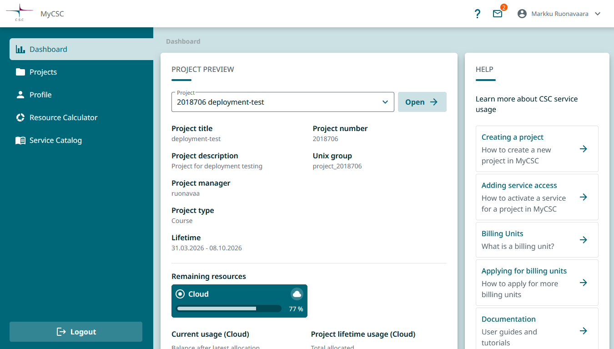

---
hide:

  - toc
---

# CSC-palvelut Haaga-Heliassa

Tälle sivustolle on koottu ohjeita CSC-palvelujen käyttämisestä Haaga-Helia ammattikorkeakoulun opetuksessa.

## Käyttäjätili

CSC-palvelujen käyttöön tarvitaan CSC-käyttäjätili. Tilin voi luoda kirjautumalla MyCSC-portaaliin osoitteessa <https://my.csc.fi> korkeakoulujen Haka-kirjautumispalvelun avulla. 

CSC-tunnuksen luominen tapahtuu ensimmäisen kirjautumisen yhteydessä. Jatkossa  MyCSC-portaaliin voi kirjautua joko suoraan Haka-tunnistuksella tai luodulla CSC-tunnuksella. 

Tunnusten luonnin ja kirjautumisen jälkeen avautuu MyCSC-portaalin hallintanäkymä.

## Projektit ja palvelut

MyCSC-portaalissa perustetaan __projekteja__. Web-käyttöisen hallintanäkymän kautta MyCSC-projektiin voidaan liittää käyttäjiä ja __palveluja__.

CSC-palvelua (esimerkiksi _Rahti_) konfiguroidessa puhutaan myös _projektista_. MyCSC-projekti sisältää palveluja, jotka konfiguroidaan kunkin palvelun omassa projektissa. Muuta yhteistä näillä kahdella projektilla ei kuitenkaan ole.

Käsitteiden selkiyttämiseksi näissä ohjeissa eri projekteista käytetään termejä __MyCSC-projekti__ ja __palveluprojekti__ (esim. _Rahti-projekti_. MyCSC-projekti on hallinnollinen projekti, johon voidaan liittää joukko palveluprojekteja.

## Lisätietoa

CSC-palveluiden dokumentaatio löytyy osoitteesta <https://docs.csc.fi/>.
