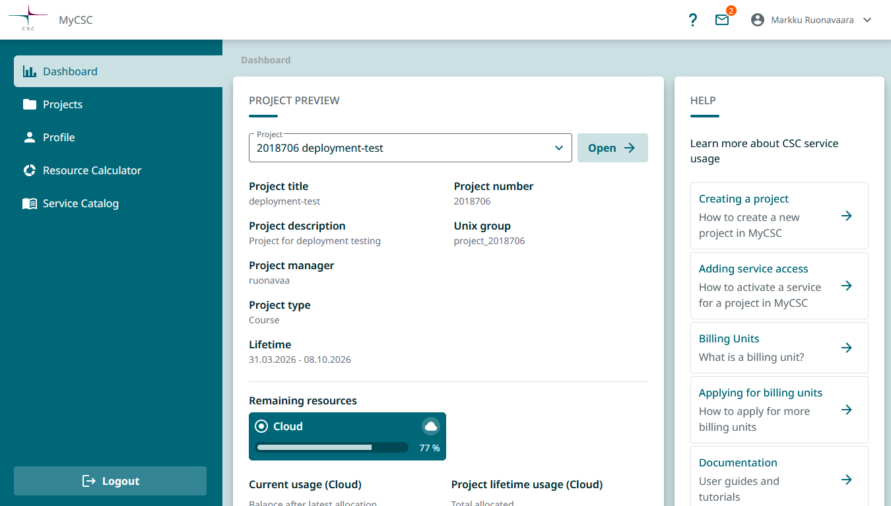
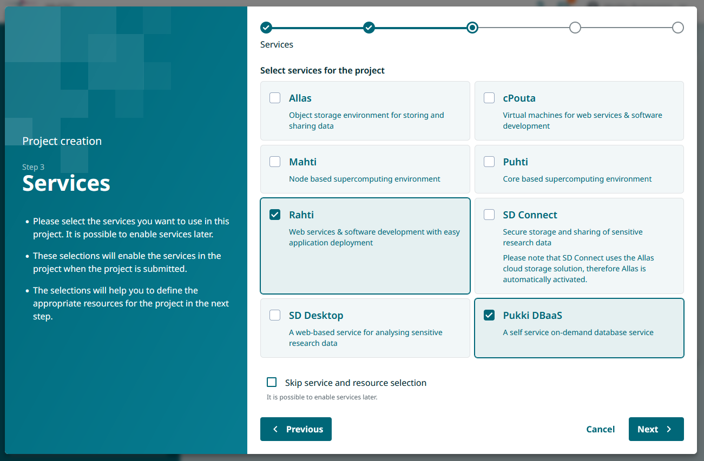

---
hide:
  - toc
---
# CSC-palvelut Haaga-Heliassa

CSC:n palvelut ovat Haaga-Helian opiskelijoiden ja henkilökunnan käytettävissä  opetus- ja tutkimuskäyttöön maksutta.

Tälle sivustolle on koottu ohjeita CSC-palvelujen käyttämisestä Haaga-Helia ammattikorkeakoulun opetuksessa.

## Käyttäjätili

CSC-palvelujen käyttöön tarvitaan CSC-käyttäjätili. Tilin voi luoda kirjautumalla MyCSC-portaaliin osoitteessa <https://my.csc.fi> korkeakoulujen Haka-kirjautumispalvelun avulla. 

## MyCSC-projektit

Tunnusten luonnin ja kirjautumisen jälkeen päästään MyCSC-portaalin hallintanäkymään.

{width="70%"}

MyCSC-portaalissa perustetaan ja hallinnoidaan projekteja, joista tässä materiaalissa käytetään termiä __MyCSC-projekti__. 

MyCSC-projekti on hallinnollinen projekti, johon voidaan liittää joukko palveluja. Projektin kautta projektin jäsenet pääsevät käsiksi CSC:n palveluihin. 

## Palvelujen liittäminen projektiin

Oletuksena mitään palvelua ei ole liitetty projektiin, vaan projektipäällikkö valitsee haluamansa palvelut MyCSC-portaalin projektin hallintanäkymästä projektia luodessaan.

{width="70%"}

MyCSC-projektiin lisätyistä palveluista lähetetään kaikille projektin jäsenille sähköposti, jossa pyydetään hyväksymään palvelun ehdot MyCSC-sivustolla.

Kun halutut palvelut on valittu projektille ja käyttäjät ovat hyväksyneet palvelun käyttöönoton, voidaan niiden käyttö aloittaa.

## Palvelujen käyttö

Kun projektille on valittu halutut palvelut, niiden käyttöönotto ja hallinta tapahtuu kunkin palvelun omalta sivustolta. 

Oheiseen taulukkoon on listattu muutamia tärkeimpiä palveluita ja niiden osoitteet.

| Palvelu   | Osoite                     | Kuvaus                     |
| --------- | -------------------------- | -------------------------- |
| cPouta    | https://pouta.csc.fi       | Virtualisointipalvelu      |
| Rahti     | https://rahti.csc.fi       | Konttipalvelu              |
| Pukki     | https://pukki.dbaas.csc.fi | Tietokantapalvelu (DBaaS)  |

## MyCSC-projektit kursseilla

Kursseilla käytetään pääosin opiskelijoiden itse perustamia __opiskelijaprojekteja__, joissa opiskelija itse toimii projektipäällikkönä. 

Opiskelijaprojektin kesto on maksimissaan kuusi kuukautta, ja sille on varattu resursseja kiinteä määrä, jota ei voi kasvattaa. Yhdellä opiskelijakäyttäjällä voi olla yksi kurssiprojekti kerrallaan.

Myös ryhmäprojektit voidaan toteuttaa opiskelijaprojektissa, sillä opiskelijaprojektiin voi kutsua muita käyttäjiä jäseniksi. Opiskelijaprojektin kiintiörajat riittävät normaalisti hyvin opintojaksojen projekteille.

Myös muita projektityyppejä, kuten kurssiprojekteja, voidaan käyttää. Tällöin  projektin perustaa ja sitä hallinnoi opintojakson opettaja. Tästä on erilliset ohjeet:
  
  - Opettajan ohje: [Kurssiprojektin käyttö](./kurssiprojekti_opettajan_ohje.md){target="_blank"}.
  - Opiskelijan ohje: [Kurssiprojektiin liittyminen](./kurssiprojekti_opiskelijan_ohje.md){target="_blank"}.

## Lisätietoa

- CSC-palvelujen virallinen dokumentaatio: <https://docs.csc.fi>
- CSC:n tutoriaaleja palvelujen käytöstä: <https://cssedu.csc.fi>
