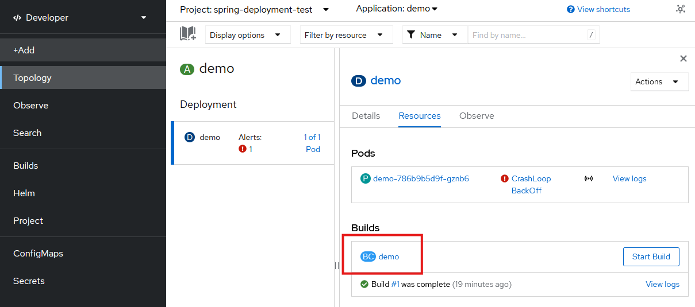

# Buildin automatisointi

Jos sovellukselle on _build config_, jolla julkaisu tehdään GitHub-repositoriosta, voidaan build konfiguroida käynnistymään automaattisesti, kun repositorioon pusketaan uutta koodia.

Uusi build liipaistaan määrittämällä GitHub-repositorioon _webhook_, jota repositorio kutsuu aina, kun uusia muutoksia pusketaan.

Webhook-URL löytyy Rahti-palvelun käyttöliittymässä _BuildConfig details_-näkymästä.

Kopioi URL ja lisää se Github-repositorioon GitHubin web-käyttöliittymän kohdassa _Settings/Webhooks/Add webhook_.

Content type-asetuksen tulee olla `application/json`.
