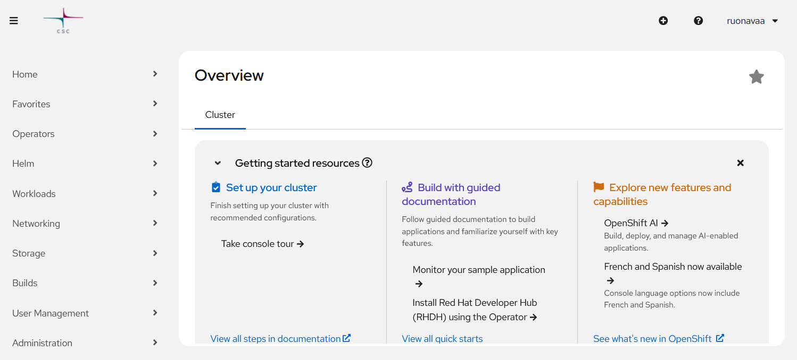
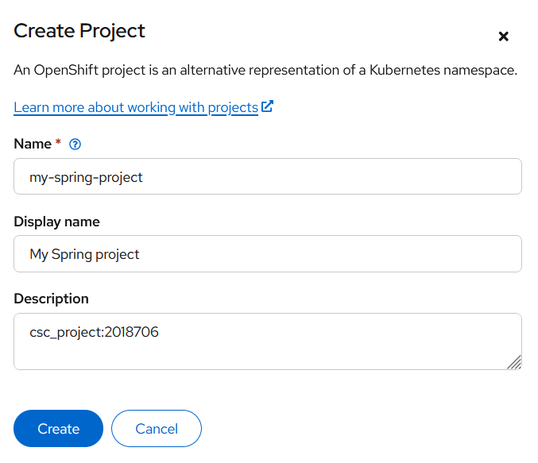

# Rahti-projektin luonti

## Ennakkovaatimukset

Jotta Rahti-palvelua voi käyttää,

- on oltava CSC-projektin jäsen, ja
- Rahti-palvelun tulee olla otettuna käyttöön MyCSC projektissa.

## Rahti-projektin luonti web-käyttöliittymässä

Avaa Rahti-palvelun web-käyttöliittymä osoitteessa <https://rahti.csc.fi> ja kirjaudu palveluun CSC-tunnuksellasi. Kirjautumisen jälkeen palvelun etusivu näyttää osapuilleen tältä:



Luo uusi Rahti-projekti valitsemalla _Home/Projects_, ja paina _Create project_ linkkiä. 

Anna projektille yksikäsitteinen nimi, joka koostuu pienistä kirjaimista, numeroista ja väliviivoista (esimerkiksi `my-spring-service`). Lisäksi voit antaa selkokielisen nimen, joka näytetään palvelun käyttöliittymässä 



MyCSC:n projektinäkymässä näkyvä projektinumero tulee mainita Rahti-projektin kuvauskentässä. Tällä mekanismilla palvelun käytöstä syntyneet kulut kohdennetaan määriteltyyn MyCSC-projektiin.

Kirjaa projektinumero projektin kommenttikenttään seuraavasti:
```
csc_project:<projektinumero>
```
Korvaa `<projektinumero>` oman MyCSC-projektisi numerosarjalla.

Kun painat _Create_, luodaan Rahti-projekti, johon voidaan määritellä tarvittavia palveluja ja resursseja.

### Jäsenten lisääminen Rahti-projektiin

Rahti-projektit ovat sidottuja MyCSC-projekteihin, ja oletuksena ne näkyvät vain MyCSC-projektin jäsenille. 

Projektin omistaja voi lisätä muita käyttäjiä MyCSC-palvelussa, esimerkiksi projektitiimin muut jäsenet tai kurssin opettajan.

## Projektin luominen komentorivikomennoin

Voit luoda Rahti-projektin myös komentoriviltä `oc`-komennoin. Seuraavissa esimerkeissä luotavan projektin nimi on `myproj`.

```
oc new-project myproj --description='csc_project:xxxxxxx'
```

-  `xxxxxxx` korvataan oman CSC-projektin numerolla, johon Rahti-projekti luodaan.