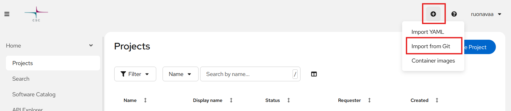
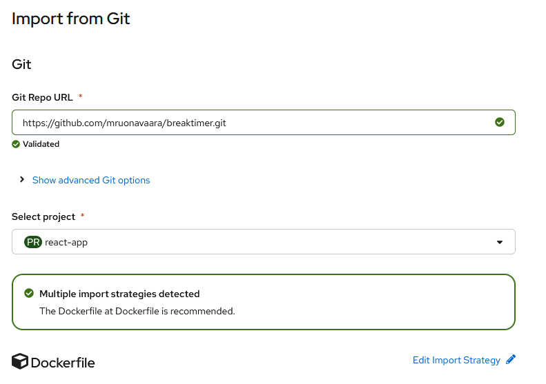
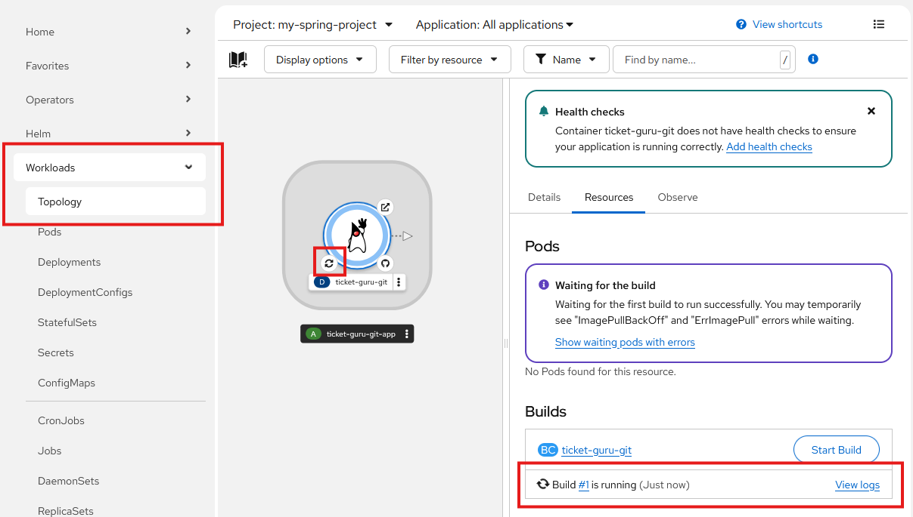
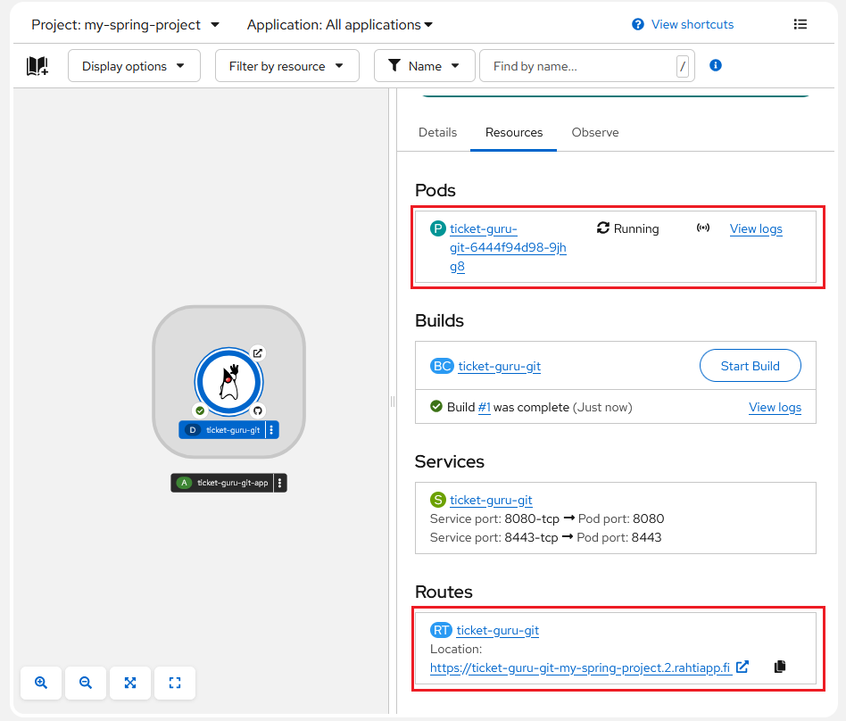

# React-sovelluksen julkaiseminen

## Sovelluksen valmistelu julkaisua varten

Julkaisu tehdään käyttäen Docker-konttia. Kontin levykuva tekee ensin React-buildin ja käynnistää sitten nginx-web-palvelimen jakamaan sovellusta.

Lisää projektin juureen Dockerfile-niminen tiedosto, jonka sisältö on seuraava:
```dockerfile
# Use an official Node runtime as a parent image
FROM node:19-alpine AS build
# Set the working directory to /app
WORKDIR /app
# Copy the package.json and package-lock.json to the container
COPY package*.json ./
# Install dependencies
RUN npm ci
# Copy the rest of the application code to the container
COPY . .
# Build the React app
RUN npm run build

# Use a non-root nginx image to serve the React app
FROM bitnamisecure/nginx:latest
# Copy React build to nginx HTML directory 
COPY --from=build /app/dist /usr/share/nginx/html/
# Copy nginx-configuration file 
COPY --from=build /app/nginx.conf /etc/nginx/conf.d/default.conf
WORKDIR /usr/share/nginx/html/
EXPOSE 8080
```

- `<build-dir>` on hakemisto, johon React build tehtiin. 

Konfiguroi tiedostoon oikea build-hakemisto: Vite-ympäristössä hakemisto on oletusarvoisesti `dist`, Create React App -ympäristössä `build`

Lisää projektin juureen nginx-konfiguraatiotiedosto `nginx.conf` seuraavalla sisällöllä:
```nginx
server {
  listen 8080;
  root /usr/share/nginx/html;
  location / {
    index  index.html;
    try_files $uri $uri/ /index.html;
  }
}
```

Dockerfilen toimivuus kannattaa testata paikallisessa Docker-ympäristössä. Asenna Docker, käynnistä Docker Desktop ja anna projektin juuressa komennot:
```bash
docker build -t myimage .
docker run -p 80:8080 --name myapp myimage
```
Sovelluksen pitäisi vastata osoitteesta http://localhost:80.

## Julkaisu web-käyttöliittymässä

## Sovelluksen luonti web-käyttöliittymässä

Voit nyt julkaista React-sovelluksesi Rahti-palvelussa. Klikkaa oikeasta yläkulmasta pientä `+` -ikonia ja valitse _Import from git_.



_Import from Git_-lomakkeella määritellään, mistä repositoriosta sovellusprojekti haetaan, ja miten build ja julkaisu tehdään.



Seuraavassa käydään läpi lomakkeen kenttien selitykset ja suositellut valinnat. PAkolliset kentät on lihavoitu. Riippuen valinnoistasi kaikkia kenttiä ei välttävättä näytetä lainkaan. Osa kentistä on _Show advanced option_-valinnan takana. 

| Kenttä  | Selitys               | 
| :------ | :---------------------|
| __Git Repo URL__    | Repositorion osoite. Huom! Jos repositorio on yksityinen, osoite pitää antaa SSH-muodossa (esim. `git@github.com:username/reponame.git`). |
| Git reference   | Haara, tag tai commit, josta julkaisu tehdään. Ei tarvita, jos julkaisu tehdään oletushaarasta. |
| Context dir           | Sovellusprojektin juurihakemisto, oletusarvoisesti repositorion juurihakemisto `/`. |
| Source Secret         | Salaisuus, joka sisältää repositoriopääsyyn tarvittavan SSH-avaimen. Tarvitaan vain, jos repositorio on yksityinen. Salaisuuden voi myös luoda  valinnalla _Create new Secret_. |
| __Select project__        | Valitse projekti, johon sovellus luodaan. |

Tässä ohjeessa käytämme Dockerfile-julkaisumenetelmää. Jos se ei ole jo suositeltuna, voit valita sen _Edit Import Strategy_-valinnalla. 

Valitesemalla _Edit Import Strategy_-valinnalla tulee Dockerfile-julkaisuun liittyviä kenttiä:


| Kenttä  | Selitys               | 
| :------ | :---------------------|
| __Dockerfile path__       | Jos valitsit metodiksi _Dockerfile_, voit määrittää ``Dockerfile``:n sijainnin ja nimen. Oletusarvoisesti nimi on ``Dockerfile`` ja sijainti sovelluksen juuressa. |

Kaikkien julkaisumenetelmien yhteisiä valintoja ovat:

| Kenttä  | Selitys               | 
| :------ | :---------------------|
| Application               | Sovelluksen nimi. |
| __Name__                  | Sovelluksen tunniste, joka liitetään kaikkiin sovellukseen luotaviin resursseihin etuliitteksi. |
| Build Option              | Valitse oletus _Build Config_ ja muut oletukset. |
| Resource type             | Valitse oletus _Deployment_ ja muut oletukset. |
| Target port               | Palveluun luodun reitin portti. Valitse oletus `8080` ja muut oletukset. |

Kun painat valintaa _Create_, tarvittavat resurssit luodaan ja build käynnistyy. Voit seurata buildin etenemistä web-käyttöliittymässä linkistä _View logs_ tai klikkaamalla build status -symbolia graafisesta esityksestä.



Kun julkaisu on onnistunut, projektiin on ilmaantunut _Deployment_, jossa on toivottavasti käynnissä oleva kontti (_Pod_), palvelu (_Service_) sekä reitti (_Route_). josta sovelluksesi vastaa. Voit tarkastella sovelluksesi käynnistymistä ja toimintaa podin lokitiedoista (linkki _View logs_). Kun sovellus on käynnissä, voit klikata reitin URL-osoitetta (osiossa _Routes_) ja tarkistaa, että sovelluksesi vastaa odotetusti.

Jos jokin meni pielee, tilannetta voi selvitellä luvun [Virheenjäljitys](virheenjaljitys.md) ohjeiden avulla.



Kun olet tehnyt muutoksia sovellukseesi, voit käynnistää uuden buildin manuaalisesti klikkaamalla _Start Build_ -painiketta. Build voidaan myös automatisoida tapahtumaan aina, kun GitHub-repositorioon pusketaan uusi versio lähdekoodista, ks. [Buildin automatisointi](buildin_automatisointi.md).

## Julkaisu komentorivillä

Jotta tässä luvussa käytettäviä `oc`-komentoja voi antaa, on ensin kirjauduttava Rahti-palveluun luvun [Rahti-palveluun kirjautuminen komentorivillä](#rahti-palveluun-kirjautuminen-komentorivilla) ohjeiden mukaisesti.

Jos repositorio on julkinen, voit luoda projektiin sovelluksen (_application_) komennolla:
```bash
oc new-app <repository-URL>#<branch-name>
```

- `<repository-URL>` on osoite, josta repositorion voi kloonata
- `<branch-name>` on haara, josta julkaistaan.

Jos repositorio on yksityinen, on komentoon lisättävä tieto käytettävästä SSH-avaimesta:

```bash
oc new-app <repository-URL>#<branch-name> --source-secret=<github-secret>
```

- `<github-secret>` on SSH-avaimen sisältävän salaisuuden nimi.

Tuloksena syntyy build config ja build käynnistyy. Voit seurata buildin etenemistä web-käyttöliittymässä.

Kun julkaisu on onnistunut, projektiin on ilmaantunut deployment-konfiguraatio sekä toivottavasti käynnissä oleva palvelu.

Kun palvelu on luotu. tarvitaan vielä reitti:

```bash
oc expose service <service-name>
```

- `<service-name>` on äsken luodun palvelun nimi, oletusarvoisesti sama kuin <deployment-config-name>

Tällä syntyy reittikin, ja palvelu on julkaistu verkkoon HTTP-protokollalla. Jos halutaan https-pääsy, on se konfiguroitava erikseen, ks. luku [HTTPS-konfigurointi](#https-konfigurointi)

## Buildin käynnistäminen

Julkaisun jälkeen uusi julkaisu voidaan käynnistää manuaalisesti web-käyttöliittymästä tai komentorivillä `oc`-komennolla.  

```bash
oc start-build <build-config-name>
```

- `<build-config-name>` on oletusarvoisesti sama kuin `<deployment-config-name>`

Build voidaan myös automatisoida tapahtumaan aina, kun GitHub-repositorioon pusketaan uusi versio lähdekoodista.

