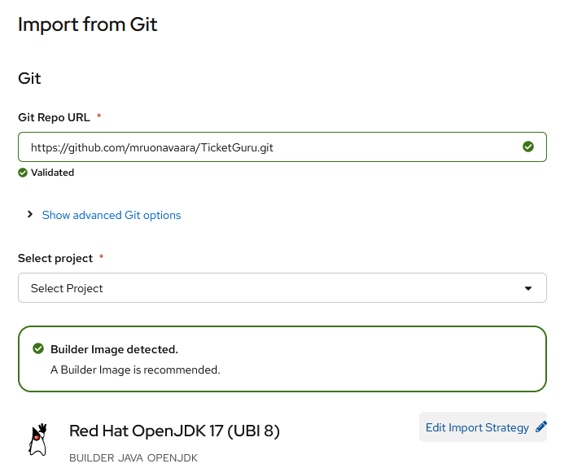
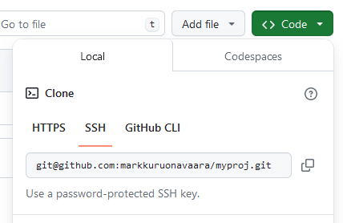

# Spring Boot -palvelimen julkaisu ilman ulkoista tietokantaa

Seuraavassa käydään läpi Spring Boot -palvelimen julkaisu ilman ulkoista tietokantaa. Ulkoisen tietokannan luonti ja konfigurointi käsitellään dokumentissa [Spring Boot -palvelimen julkaisu Rahti-palvelussa Pukki-tietokantapalvelun avulla](spring_rahti_pukki.md).

Rahti-palvelun työkaluilla voidaan luoda sovelluksen julkaisuun tarvittavat resurssit repositorion sisällön perusteella automaattisesti. Resurssit voidaan luoda joko 

1. suoraan lähdekoodin perusteella (_Source-to-Image_, _S2I_) tai 
2. projektissa määritetyn Dockerfile:n perusteella. 

Materiaalissa annetaan ohjeet molempiin tapoihin. Tavat ovat vaihtoehtoisia.

## Spring-projektin valmistelu julkaisua varten

### Projektin repositorio

#### Projektin sijainti

Build-työkalut olettavat, että sovellusprojekti sijaitsee repositorion juurihakemistossa. Jos näin ei ole, sinun on erikseen annettava työkaluille tieto siitä, missä hakemistossa Spring Boot -projekti sijaitsee. 

#### Repositorio-oikeudet

Rahti-työkalut tarvitsevat pääsyn projektin repositorioon. Jos repositorio on julkinen, ei pääsyoikeuksia tarvitse erikseen määrittää.

Jos repositorio on yksityinen, on Rahti-projektille järjestettävä pääsy luvun [Julkaisu yksityisestä GitHub-repositoriosta](julkaisu_yksityisesta_repositoriosta.md) ohjeiden mukaisesti.

### Spring-projekti

#### Source-to-Image-julkaisu

Jos käytät Source-to-Image -julkaisua, ei tarvita erillisiä valmisteluja. 

#### Dockerfile-julkaisu

Jos käytät Dockerfile-julkaisua, lisää Spring-projektin juureen tiedosto `Dockerfile`, jonka sisältö on seuraava:

```dockerfile
    # BUILD-VAIHE
    FROM eclipse-temurin:17-jdk-focal AS builder
    WORKDIR /opt/app
    # Kopioi Mavenin asetukset ja projektin metadata
    COPY .mvn/ .mvn
    COPY mvnw pom.xml ./
    RUN chmod +x ./mvnw
    # Lataa riippuvuudet
    RUN ./mvnw dependency:go-offline
    # Kopioi lähdekoodi
    COPY ./src ./src
    # Buildaa projekti
    RUN ./mvnw clean install -DskipTests
    # Kopioi JAR-tiedosto
    RUN cp target/*.jar /opt/app/app.jar

    # RUNTIME-VAIHE
    FROM eclipse-temurin:17-jre-alpine
    WORKDIR /opt/app
    # Kopioi buildattu JAR-tiedosto build-vaiheesta
    COPY --from=builder /opt/app/app.jar /opt/app/app.jar
    EXPOSE 8080
    ENTRYPOINT ["java", "-jar", "/opt/app/app.jar"]
``` 
    Määritys on laadittu yleiskäyttöiseksi, sen pitäisi toimia missä tahansa Spring Boot -projektissa sellaisenaan.

## Sovelluksen luonti web-käyttöliittymässä

Voit nyt julkaista Spring Boot -sovelluksesi Rahti-palvelussa. Klikkaa oikeasta yläkulmasta pientä `+` -ikonia ja valitse _Import from git_.


_Import from Git_-lomakkeella määritellään, mistä repositoriosta sovellusprojekti haetaan, ja miten build ja julkaisu tehdään.



Seuraavassa käydään läpi lomakkeen kenttien selitykset ja suositellut valinnat. PAkolliset kentät on lihavoitu. Riippuen valinnoistasi kaikkia kenttiä ei välttävättä näytetä lainkaan. Osa kentistä on _Show advanced option_-valinnan takana. 

| Kenttä  | Selitys               | 
| :------ | :---------------------|
| __Git Repo URL__    | Repositorion osoite. Huom! Jos repositorio on yksityinen, osoite pitää antaa SSH-muodossa (esim. `git@github.com:username/reponame.git`). |
| Git reference   | Haara, tag tai commit, josta julkaisu tehdään. Ei tarvita, jos julkaisu tehdään oletushaarasta. |
| Context dir           | Sovellusprojektin juurihakemisto, oletusarvoisesti repositorion juurihakemisto `/`. |
| Source Secret         | Salaisuus, joka sisältää repositoriopääsyyn tarvittavan SSH-avaimen. Tarvitaan vain, jos repositorio on yksityinen. Salaisuuden voi myös luoda  valinnalla _Create new Secret_. |
| __Select project__        | Valitse projekti, johon sovellus luodaan. |

Tässä vaiheessa voit valita, haluatko luoda sovelluksesi Dockerfile:n vai Source-to-Image-työkalujen avulla. 

Voit vaihtaa julkaisumenetelmää valitsemalla _Edit Import Strategy_. Valinta vaikuttaa siihen, mitä muita kenttiä lomakkeessa näytetään. 

=== "Source-to-Image"

    Source-to-Image -julkaisussa ei ole erityisiä asetuksia. Jos valitset julkaisumenetelmäksi _Dockerfile_ tai _Builder Image_, on tehtävä lisävalintoja.

=== "Dockerfile"

    | Kenttä  | Selitys               | 
    | :------ | :---------------------|
    | __Dockerfile path__       | Jos valitsit metodiksi _Dockerfile_, voit määrittää ``Dockerfile``:n sijainnin ja nimen. Oletusarvoisesti nimi on ``Dockerfile`` ja sijainti sovelluksen juuressa. |

=== "Builder Image"

    | Kenttä  | Selitys               | 
    | :------ | :---------------------|
    | __Builder Image__         | Jos valitsit metodiksi _Builder Image_, valitse _Java_. |
    | __Builder Image version__ | Jos valitsit metodiksi _Builder Image_, valitse versio, jonka JDK vastaa projektisi JDK-versiota. |

Kaikkien julkaisumenetelmien yhteisiä valintoja ovat:

| Kenttä  | Selitys               | 
| :------ | :---------------------|
| Application               | Sovelluksen nimi. |
| __Name__                  | Sovelluksen tunniste, joka liitetään kaikkiin sovellukseen luotaviin resursseihin etuliitteksi. |
| Build Option              | Valitse oletus _Build Config_ ja muut oletukset. |
| Resource type             | Valitse oletus _Deployment_ ja muut oletukset. |
| Target port               | Palveluun luodun reitin portti. Valitse oletus `8080` ja muut oletukset. |

Kun painat valintaa _Create_, tarvittavat resurssit luodaan ja build käynnistyy. Voit seurata buildin etenemistä web-käyttöliittymässä linkistä _View logs_ tai klikkaamalla build status -symbolia graafisesta esityksestä.


Kun julkaisu on onnistunut, projektiin on ilmaantunut _Deployment_, jossa on toivottavasti käynnissä oleva kontti (_Pod_), palvelu (_Service_) sekä reitti (_Route_). josta sovelluksesi vastaa. Voit tarkastella sovelluksesi käynnistymistä ja toimintaa podin lokitiedoista (linkki _View logs_). Kun sovellus on käynnissä, voit klikata reitin URL-osoitetta (osiossa _Routes_) ja tarkistaa, että sovelluksesi vastaa odotetusti.

Jos jokin meni pielee, tilannetta voi selvitellä luvun [Virheenjäljitys](virheenjaljitys.md) ohjeiden avulla.


Kun olet tehnyt muutoksia sovellukseesi, voit käynnistää uuden buildin manuaalisesti klikkaamalla _Start Build_ -painiketta. Build voidaan myös automatisoida tapahtumaan aina, kun GitHub-repositorioon pusketaan uusi versio lähdekoodista, ks. [Buildin automatisointi](buildin_automatisointi.md).

## Sovelluksen luonti komentorivillä

Sovellus voidaan luoda komentorivikomennoilla. Tämä tapa on vaihtoehtoinen web-käyttöliittymän käytölle.

__Huom!__ Jotta tässä luvussa käytettäviä `oc`-komentoja voi antaa, on ensin kirjauduttava Rahti-palveluun luvun [Rahti-palveluun kirjautuminen komentorivillä](komentorivityokalun_asennus.md#rahti-palveluun-kirjautuminen-komentorivilla) ohjeiden mukaisesti.

Kirjaudu ensin Rahti-palveluun komentorivillä ja aseta luomasi projekti aktiiviseksi.

```bash
oc project myproject
```

Uusi sovellus voidaan luoda komentorivikomennolla `oc new-app`. Komennolle annetaan parametrina repositorio-osoite, josta projekti käydään hakemassa. 

### Sovellusprojektin sijainti repositoriossa

Jos sovellusprojekti ei sijaitse repositorion juurihakemistossa, projektihakemisto annetaan `oc new-app`-komennossa valitsinparametrilla `--context-dir`:

```bash
--context-dir=<projektihakemisto>
```
- `<projektihakemisto>` on suhteellinen polku repositorion juuresta siihen hakemistoon, jossa sovellusprojekti sijaitsee, esim. `--context-dir=myproj`. 

### Repositorio-oikeudet

Jos repositorio on julkinen, ei pääsyoikeuksia tarvitse erikseen määrittää.

Jos repositorio on yksityinen, annettavissa komennoissa on annettava  tieto tarvittavasta SSH-avaimesta valitsimella 

```bash
--source-secret=<github-creds-secret-name>
```

- `<github-creds-secret-name>` on salaisuus, joka sisältää yksityisen SSH-avaimen.

Tässä tapauksessa repositorion osoite pitää antaa SSH-muodossa, esim:

```bash
git@github.com:<user>/<repositorionimi>.git
```


### Sovelluksen luontikomennot

Seuraavissa esimerkeissä käydään läpi sovelluksen luonti molemmilla edellä mainituilla tavoilla. Kaikki komennot tehdään komentoriviltä. 

=== "Dockerfilen perusteella"

    Jos repositorio on julkinen, voit luoda projektiin sovelluksen (_application_) komennolla:
    ```bash
    oc new-app <repository-URL>#<branch-name>
    ```
    - `<repository-URL>` on osoite, josta repositorion voi kloonata
    - `<branch-name>` on haara, josta julkaistaan.

    Jos repositorio on yksityinen, on komentoon lisättävä tieto käytettävästä SSH-avaimesta:

    ```bash
    oc new-app <repository-URL>#<branch-name> --source-secret=<github-creds-secret-name>
    ```

=== "Source-to-Image-työkaluilla"

    Jos repositorio on julkinen, voit luoda projektiin sovelluksen (_application_) komennolla:

    ```
    oc new-app registry.access.redhat.com/ubi8/openjdk-17:1.18-2~<repository-URL>#<branch-name>
    ```
    - `registry.access.redhat.com/ubi8/openjdk-17:1.18-2` on S2I-työkalulevykuva Java 17-sovelluksille
    - `<repositorio-URL>` on osoite, josta repositorion voi kloonata
    - `<branch-name>` on haara, josta julkaistaan.

    Jos repositorio on yksityinen, on komentoon lisättävä tieto käytettävästä SSH-avaimesta:
    ```
    oc new-app registry.access.redhat.com/ubi8/openjdk-17:1.18-2~<repository-URL>#<branch-name> --source-secret=<github-creds-secret-name>
    ```

Komennon tuloksena ludoaan tarvittavat resurssit ja build käynnistyy. Voit seurata buildin etenemistä web-käyttöliittymässä.

Kun julkaisu on onnistunut, projektiin on ilmaantunut _Deployment_, jossa on toivottavasti käynnissä oleva kontti (_Pod_) ja palvelu (_Service_). Jos näin ei ole, tilannetta voi selvitellä luvun [Virheenjäljitys](virheenjaljitys.md) ohjeiden avulla.

Tämän jälkeen on vielä avattava palvelulle reitti (_route_), jolla palveluun pääsee internetistä. Sen voi tehdä komennolla:

```bash
oc expose service <service-name>
```
- `<service-name>` on äsken luodun palvelun nimi, oletusarvoisesti sama kuin sovelluksen nimi. Sovelluksen palvelut voi katsoa web-käyttöliittymästä tai listata komennolla `oc get svc`.

Oletusarvoisesti luodaan salaamaton http-reitti. Jos halutaan https-pääsy, on se konfiguroitava erikseen, ks. luku [HTTPS-konfigurointi](#https-konfigurointi)

### Buildin käynnistäminen manuaalisesti

Julkaisun jälkeen uusi julkaisu voidaan käynnistää manuaalisesti web-käyttöliittymästä tai komentorivillä `oc`-komennolla.  
```bash
oc start-build <build-config-name>
```
- `<build-config-name>` on oletusarvoisesti sama kuin `<deployment-config-name>`

Build voidaan myös automatisoida tapahtumaan aina, kun GitHub-repositorioon pusketaan uusi versio lähdekoodista
