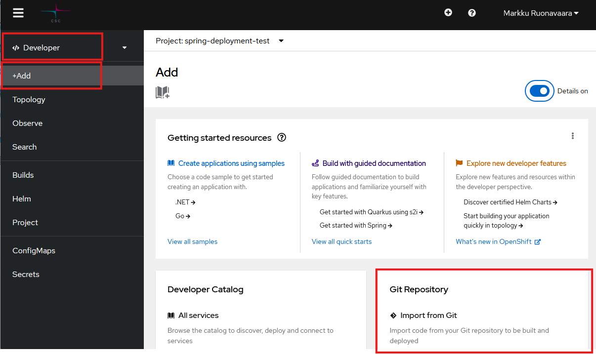
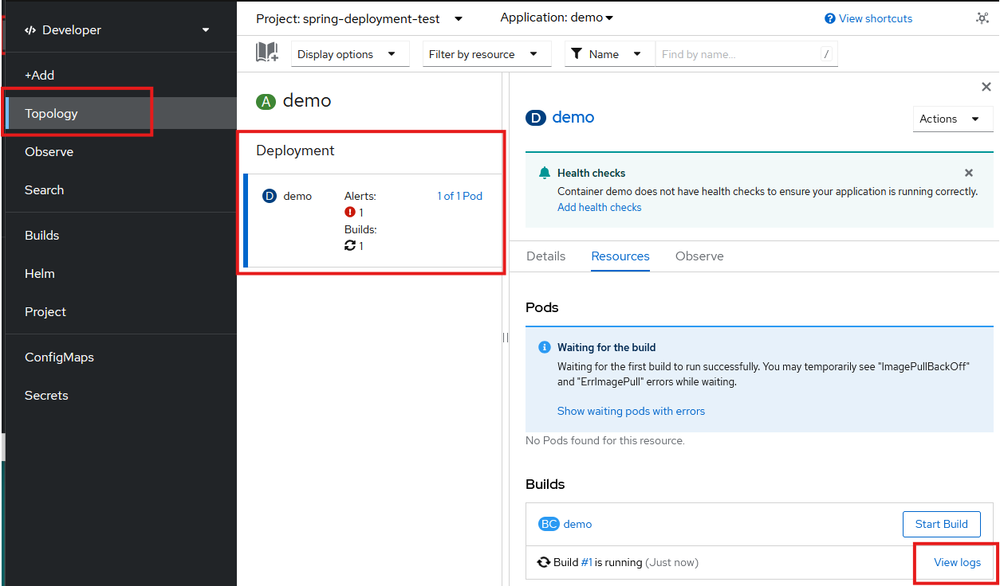

# Spring Boot -palvelimen julkaisu ilman ulkoista tietokantaa

Seuraavassa käydään läpi Spring Boot -palvelimen julkaisu ilman ulkoista tietokantaa.

Tietokannan konfigurointi käsitellään seuraavassa luvussa.

Rahti-palvelun työkaluilla voidaan luoda sovelluksen julkaisuun tarvittavat resurssit repositorion sisällön perusteella automaattisesti. Resurssit voidaan luoda joko 

1. suoraan lähdekoodin perusteella (_Source-to-Image_, _S2I_) tai 
2. projektissa määritetyn Dockerfile:n perusteella. 

Materiaalissa annetaan ohjeet molempiin tapoihin. Tavat ovat vaihtoehtoisia.

## Projektin valmistelu julkaisua varten

### Projektin sijainti repositoriossa

Build-työkalut olettavat, että sovellusprojekti sijaitsee repositorion juurihakemistossa. Jos näin ei ole, sinun on erikseen annettava työkaluille tieto siitä, missä hakemistossa Spring Boot -projekti sijaitsee.

### Repositorio-oikeudet

Rahti-työkalut tarvitsevat pääsyn projektin repositorioon. Jos repositorio on julkinen, ei pääsyoikeuksia tarvitse erikseen määrittää.

Jos repositorio on yksityinen, on Rahti-projektille järjestettävä pääsy luvun [Julkaisu yksityisestä GitHub-repositoriosta](julkaisu_yksityisesta_repositoriosta.md) ohjeiden mukaisesti.

### Spring-projektin valmistelu

Jos käytät Source-to-Image -julkaisua, ei tarvita erillisiä valmisteluja. 

Jos käytät Dockerfile-julkaisua, lisää Spring-projektin juureen tiedosto `Dockerfile`, jonka sisältö on seuraava:

```dockerfile
    FROM eclipse-temurin:17-jdk-focal as builder
    WORKDIR /opt/app
    COPY .mvn/ .mvn
    COPY mvnw pom.xml ./
    RUN chmod +x ./mvnw
    RUN ./mvnw dependency:go-offline
    COPY ./src ./src
    RUN ./mvnw clean install -DskipTests 
    RUN find ./target -type f -name '*.jar' -exec cp {} /opt/app/app.jar \; -quit

    FROM eclipse-temurin:17-jre-alpine
    COPY --from=builder /opt/app/*.jar /opt/app/
    EXPOSE 8080
    ENTRYPOINT ["java", "-jar", "/opt/app/app.jar" ]
``` 
    Määritys on laadittu yleiskäyttöiseksi, sen pitäisi toimia missä tahansa Spring Boot -projektissa sellaisenaan.

## Sovelluksen luonti web-käyttöliittymässä

Sovellus voidaan luoda web-käyttöliittymän _Developer_-näkymän _Add_-osiossa _Import from Git_-lomakkeella.



Kaikkein yksinkertaisin tapaus on julkaisu julkisesta repositoriosta, jossa sovellus sijaitsee juuressa. 

Seuraavassa käydään läpi lomakkeen kenttien selitykset ja suositellut valinnat. Riippuen valinnoistasi kaikkia kenttiä ei välttävättä näytetä lainkaan. Osa kentistä on _Show advanced option_-valinnan takana. 

| Kenttä                | Selitys                                                  |
| :-------------------- | :------------------------------------------------------- |
| __Git Repo URL__ | Repositorion osoite. Huom! Jos repositorio on yksityinen, osoite pitää antaa SSH-muodossa (esim. `git@github.com:username/reponame.git`).
| __Git reference__ | Haara, tag tai commit, josta julkaisu tehdään. Ei tarvita, jos julkaisu tehdään oletushaarasta.
| __Context dir__ | Sovellusprojektin juurihakemisto, oletusarvoisesti repositorion juurihakemisto `/`.
| __Source Secret__ | Salaisuus, joka sisältää repositoriopääsyyn tarvittavan SSH-avaimen. Tarvitaan vain, jos repositorio on yksityinen. Salaisuuden voi myös luoda  valinnalla _Create new Secret_.
| __Import Strategy__ | Sovelluksen luonnissa käytettävä metodi. Valitse _Dockerfile_ tai _Builder Image_ (_Source-to-Image_).
| __Builder Image__ | Jos valitsit metodiksi _Builder Image_, valitse _Java_.
| __Builder Image version__ | Jos valitsit metodiksi _Builder Image_, valitse versio, jonka JDK vastaa projektisi JDK-versiota.
| __Application__ | Sovelluksen nimi.
| __Name__ | Sovelluksen tunniste, joka liitetään kaikkiin sovellukseen luotaviin resursseihin etuliitteksi.
| __Build Option__ | Valitse oletus _Build_ ja muut oletukset.
| __Resource type__ | Valitse oletus _Deployment_ ja muut oletukset.
| __Target port__ | Palveluun luodun reitin portti. Valitse oletus `8080` ja muut oletukset.

Kun painat valintaa _Create_, tarvittavat resurssit luodaan ja build käynnistyy. Voit seurata buildin etenemistä web-käyttöliittymässä.



Kun julkaisu on onnistunut, projektiin on ilmaantunut _Deployment_, jossa on toivottavasti käynnissä oleva kontti (_Pod_), palvelu (_Service_) sekä reitti (_Route_). josta sovelluksesi vastaa. Jos näin ei ole, tilannetta voi selvitellä luvun [Virheenjäljitys](virheenjaljitys.md) ohjeiden avulla.


## Sovelluksen luonti komentorivillä

Sovellus voidaan luoda komentorivikomennoilla. Tämä tapa on vaihtoehtoinen web-käyttöliittymän käytölle.

__Huom!__ Jotta tässä luvussa käytettäviä `oc`-komentoja voi antaa, on ensin kirjauduttava Rahti-palveluun luvun [Rahti-palveluun kirjautuminen komentorivillä](komentorivityokalun_asennus.md#rahti-palveluun-kirjautuminen-komentorivilla) ohjeiden mukaisesti.

Kirjaudu ensin Rahti-palveluun komentorivillä ja aseta luomasi projekti aktiiviseksi.

```bash
oc project myproject
```

Uusi sovellus voidaan luoda komentorivikomennolla `oc new-app`. Komennolle annetaan parametrina repositorio-osoite, josta projekti käydään hakemassa. 

### Sovellusprojektin sijainti repositoriossa

Jos sovellusprojekti ei sijaitse repositorion juurihakemistossa, projektihakemisto annetaan `oc new-app`-komennossa valitsinparametrilla `--context-dir`:

```bash
--context-dir=<projektihakemisto>
```
- `<projektihakemisto>` on suhteellinen polku repositorion juuresta siihen hakemistoon, jossa sovellusprojekti sijaitsee, esim. `--context-dir=myproj`. 

### Repositorio-oikeudet

Jos repositorio on julkinen, ei pääsyoikeuksia tarvitse erikseen määrittää.

Jos repositorio on yksityinen, annettavissa komennoissa on annettava  tieto tarvittavasta SSH-avaimesta valitsimella 

```bash
--source-secret=<github-creds-secret-name>
```

- `<github-creds-secret-name>` on salaisuus, joka sisältää yksityisen SSH-avaimen.

Tässä tapauksessa repositorion osoite pitää antaa SSH-muodossa, esim:

```bash
git@github.com:<user>/<repositorionimi>.git
```


### Sovelluksen luontikomennot

Seuraavissa esimerkeissä käydään läpi sovelluksen luonti molemmilla edellä mainituilla tavoilla. Kaikki komennot tehdään komentoriviltä. 

=== "Dockerfilen perusteella"

    Jos repositorio on julkinen, voit luoda projektiin sovelluksen (_application_) komennolla:
    ```bash
    oc new-app <repository-URL>#<branch-name>
    ```
    - `<repository-URL>` on osoite, josta repositorion voi kloonata
    - `<branch-name>` on haara, josta julkaistaan.

    Jos repositorio on yksityinen, on komentoon lisättävä tieto käytettävästä SSH-avaimesta:

    ```bash
    oc new-app <repository-URL>#<branch-name> --source-secret=<github-creds-secret-name>
    ```

=== "Source-to-Image-työkaluilla"

    Jos repositorio on julkinen, voit luoda projektiin sovelluksen (_application_) komennolla:

    ```
    oc new-app registry.access.redhat.com/ubi8/openjdk-17:1.18-2~<repository-URL>#<branch-name>
    ```
    - `registry.access.redhat.com/ubi8/openjdk-17:1.18-2` on S2I-työkalulevykuva Java 17-sovelluksille
    - `<repositorio-URL>` on osoite, josta repositorion voi kloonata
    - `<branch-name>` on haara, josta julkaistaan.

    Jos repositorio on yksityinen, on komentoon lisättävä tieto käytettävästä SSH-avaimesta:
    ```
    oc new-app registry.access.redhat.com/ubi8/openjdk-17:1.18-2~<repository-URL>#<branch-name> --source-secret=<github-creds-secret-name>
    ```

Komennon tuloksena ludoaan tarvittavat resurssit ja build käynnistyy. Voit seurata buildin etenemistä web-käyttöliittymässä.

Kun julkaisu on onnistunut, projektiin on ilmaantunut _Deployment_, jossa on toivottavasti käynnissä oleva kontti (_Pod_) ja palvelu (_Service_). Jos näin ei ole, tilannetta voi selvitellä luvun [Virheenjäljitys](virheenjaljitys.md) ohjeiden avulla.

Tämän jälkeen on vielä avattava palvelulle reitti (_route_), jolla palveluun pääsee internetistä. Sen voi tehdä komennolla:

```bash
oc expose service <service-name>
```
- `<service-name>` on äsken luodun palvelun nimi, oletusarvoisesti sama kuin sovelluksen nimi. Sovelluksen palvelut voi katsoa web-käyttöliittymästä tai listata komennolla `oc get svc`.

Oletusarvoisesti luodaan salaamaton http-reitti. Jos halutaan https-pääsy, on se konfiguroitava erikseen, ks. luku [HTTPS-konfigurointi](#https-konfigurointi)

## Buildin käynnistäminen manuaalisesti

Julkaisun jälkeen uusi julkaisu voidaan käynnistää manuaalisesti web-käyttöliittymästä tai komentorivillä `oc`-komennolla.  
```bash
oc start-build <build-config-name>
```
- `<build-config-name>` on oletusarvoisesti sama kuin `<deployment-config-name>`

Build voidaan myös automatisoida tapahtumaan aina, kun GitHub-repositorioon pusketaan uusi versio lähdekoodista
