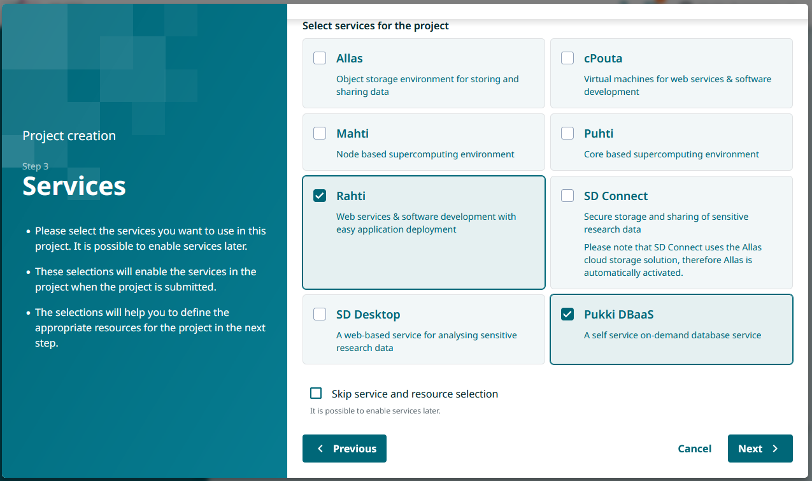
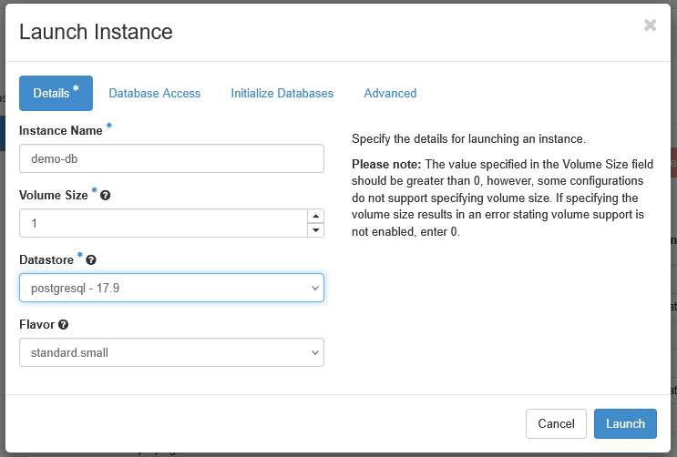
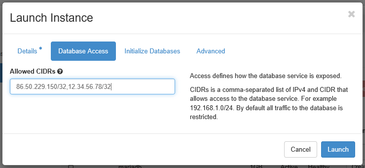
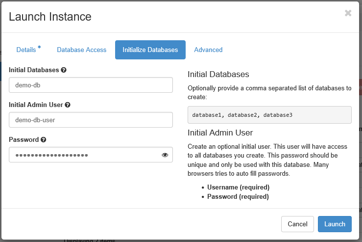
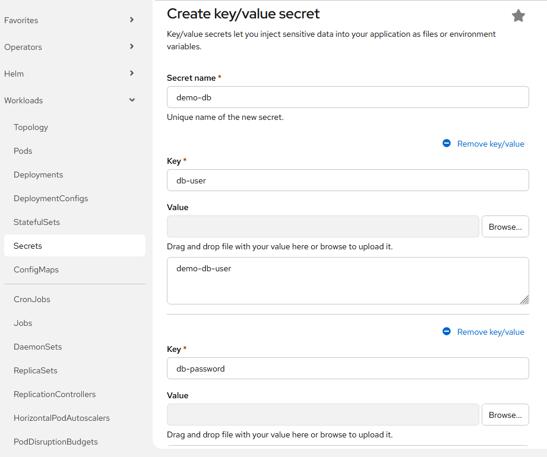
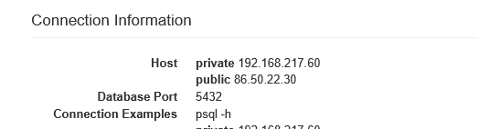
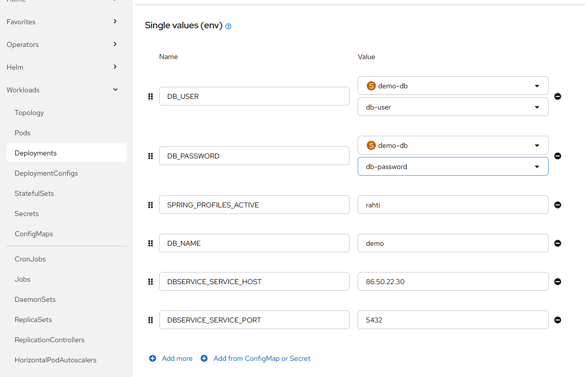

# Pukki-tietokannan konfigurointi Rahti-palvelussa julkaistuun Spring Boot -palveluun

## Tavoite

Tässä ohjeessa käydään läpi Pukki-tietokantapalvelun konfigurointi Rahti-palvelussa julkaistuun Spring Boot -palveluun. 

Oletuksena on, että palvelu on onnistuneesti julkaistu Rahdissa ja se sisältää Spring-palvelimen joka tarvitsee tietokantayhteyden. 

## Vaihe 1: Pukki-palvelun käyttöönotto MyCSC-projektissa

1. Kirjaudu MyCSC-tilillesi ja siirry projektiisi, johon haluat lisätä Pukki-tietokantapalvelun.
2. Valitse projektisi dashboardilta "Palvelut" ja klikkaa "Lisää palvelu".
3. Etsi palveluluettelosta "Pukki" ja valitse se. 



Tarvitset sekä Pukki-palvelun että Rahti-palvelun, joten varmista, että molemmat on valittu.

Palvelun lisäämisessä projektiin on viivettä, joten kestää hetken, ennen kuin voit kirjautua Pukki-palveluun.

## Vaihe 2: Tietokantainstanssin luonti Pukki-palvelussa

Kirjaudu Pukki-palveluun osoitteessa https://pukki.dbaas.csc.fi/ .

Valitse palvelun käyttöliittymästä "Launch instance" ja täytä vaaditut tiedot:
- __Instance name__: Anna instanssillesi kuvaava nimi, esimerkiksi "spring-boot-db".
- __Datastore__: Valitse haluamasi tietokantamoottori ja sen versio. Valittavana on joko PostgreSQL tai MariaDB.
- Muut kentät voit jättää oletusasetuksille.



Tietokantainstanssilla on palomuurisäännöt, jotka estävät ulkopuoliset yhteydet. Sinun on lisättävä Rahti-palvelun IP-osoite sallituksi, jotta Spring Boot -palvelusi voi muodostaa yhteyden tietokantaan. 

Voit sallia yhteydet Rahti-palvelusta lisäämällä kenttään __Allowed CIDRs__ arvon `86.50.229.150/32`. 

Lisäksi voit sallia client-yhteydet omalla IP-osoitteellasi, jotta voit testata yhteyden muodostamista tietokantaan omalta koneeltasi. Saat oman julkisen IP-osoitteesi selville esimerkiksi osoitteesta https://ifconfig.me/. Lisää perään maski `/32`, esimerkiksi `12.34.56.78/32`.

Voit lisätä useita osoitteita pilkulla eroteltuna (vain pilkulla, ei välilyöntejä).



Voit _Initialize database_-osiossa luoda tietokannan ja tietokantakäyttäjän:

- __Initial Databases__: Anna tietokannalle kuvaava nimi.
- __Initial Admin User__: Anna tietokantakäyttäjälle kuvaava nimi.
- __Password__: Anna tietokantakäyttäjälle vahva salasana.

Huomaa, että palomuurisääntö salli yhteydet kaikille Rahti-palvelun projekteille. Määritä käyttäjälle vahva salasana, jotta tietokanta on suojattu.



Kun olet täyttänyt vaaditut tiedot, klikkaa _Launch_. Tietokantainstanssin luonti kestää hetken.

Tietokantoja, tietokantakäyttäjiä ja palomuurisääntöjä voit hallinnoida myöhemmin Pukki-palvelun käyttöliittymästä.

## Vaihe 3: Tietokantayhteyden konfigurointi Spring Boot -palvelussa

Tietokantayhteyden muodostamiseen sovellus tarvitsee määrittelemäsi tietokannan nimen, tietokantakäyttäjän nimen ja salasanan, sekä tietokantainstanssin julkisen host-osoitteen ja portin.

Määritä Spring Boot -palveluusi tietokantayhteyttä varten oma profiili (esim. `rahti`) ja sille `application.properties`-tiedosto (esim. `application-rahti.properties`), johon lisäät esimerkiksi seuraavat asetukset (esimerkissä käytössä PostgreSQL-tietokanta):

```properties 
# Tietokantayhteyden asetukset
spring.datasource.url=jdbc:postgresql://${DB_SERVICE_HOST}:${DB_SERVICE_PORT}/${DB_NAME}
spring.datasource.username=${DB_USER}
spring.datasource.password=${DB_PASSWORD}

# Hibernate DDL -asetukset tarpeen mukaan
spring.jpa.show-sql=true
spring.jpa.generate-ddl=true
spring.jpa.hibernate.ddl-auto=update
```

Yllä olevassa esimerkissä tietokantayhteyden asetukset on määritetty käyttämään ympäristömuuttujia, jotka määritellään Rahti-palvelun konfiguraatiossa. Näin voit pitää tietokantayhteyden tiedot erillään sovelluskoodista ja hallita niitä Rahti-palvelun kautta.

Vie profiilitiedosto GitHub-repositorioon, josta Rahti-palvelu hakee koodin julkaistavaksi.

## Vaihe 4: Ympäristömuuttujien määrittäminen Rahti-palvelussa

Seuraavaksi välitetään tietokannan konfiguraatiotiedot sovelluksellesi. 

Tietokantakäyttäjän tiedot on hyvä määrittää salaisuutena (_Secret_) Rahti-palvelussa, ja viitata niihin ympäristömuuttujien kautta. Näin voit pitää tietokantakäyttäjään liittyvät tiedot suojattuina.

Luo Rahti-projektin käyttöliittymän osiossa _Workloads/Secrets_ uusi _Key/value -secret_, ja määritä sinne Pukki-tietokantakäyttäjäsi käyttäjätunnus ja salasana. 

`Key` on kentän tunniste, jota käytät viitatessasi tietokantakäyttäjään liittyviin tietoihin, ja `Value` on itse tieto, esimerkiksi tietokantakäyttäjätunnus tai salasana. Kenttiä voi lisätä valinnalla _Add key/value_.



Nyt pitää enää määrittää profiilissa käytetyt ympäristömuuttujat Rahti-julkaisusi (_Deployment_) konfiguraatioon:
- __DB_SERVICE_HOST__: Pukki-tietokantainstanssisi julkinen host-osoite, joka löytyy Pukki-palvelun käyttöliittymästä.
- __DB_SERVICE_PORT__: Pukki-tietokantainstanssisi portti, joka löytyy Pukki-palvelun käyttöliittymästä.
- __DB_NAME__: Tietokannan nimi, jonka määritit tietokantainstanssia luodessasi.
- __DB_USER__: Viittaus Secretissä määritettyyn tietokantakäyttäjään.
- __DB_PASSWORD__: Viittaus Secretissä määritettyyn tietokantakäyttäjän salasanaan.
- __SPRING_PROFILES_ACTIVE__: Profiili, joka sisältää tietokantayhteyden konfiguraation (esim. `rahti`).

Pukki-tietokantasi yhteystiedot löydät klikkaamalla luomaasi tietokantainstanssia Pukki-palvelun käyttöliittymässä. Yhteystiedot löytyvät _Connection information_-osiosta.

.

Avaa Rahti-julkaisusi konfiguraatio ja lisää sinne ympäristömuuttujamääritykset_Environment_-osiossa.

.

Kun painat _Save_, Rahti-palvelu julkaisee palvelusi uudelleen muuttuneella konfiguraatiolla. Uuden julkaisun jälkeen Spring Boot -palvelusi pitäisi pystyä muodostamaan yhteys Pukki-tietokantaan.

Voit tarkistaa yhteyden onnistumisen palvelusi lokista. Jos yhteys epäonnistuu, näet virheilmoituksia. Yleisiä ongelmia voivat olla esimerkiksi väärät yhteystiedot, puuttuvat palomuurisäännöt, virheelliset tietokantakäyttäjätiedot tai väärä profiili.

## Client-yhteys Pukki-tietokantaan

Voit testata tietokantayhteyttä myös omalta koneeltasi, jos olet lisännyt oman julkisen IP-osoitteesi Pukki-palvelun palomuurisääntöihin.

Tarvitset jonkin SQL-client-ohjelman, esim. DBeaver tai tietokantajärjestelmän komentorivi-client (PostgreSQL:lle psql tai MariaDB:lle mariadb). 

Yhteys  Pukki-tietokantaan määritetään samalla tavalla kuin Rahti-palvelussa, mutta suoraan client-ohjelmaan. Käytä samaa host-osoitetta, porttia, tietokannan nimeä, käyttäjätunnusta ja salasanaa kuin Rahti-palvelun konfiguraatiossa.
