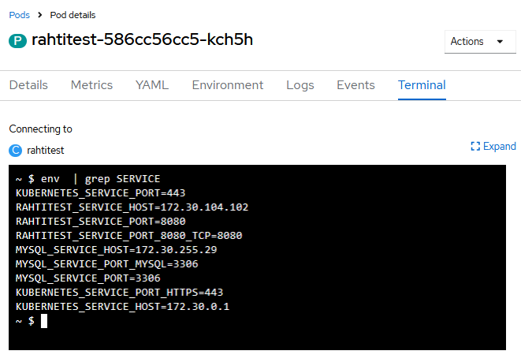
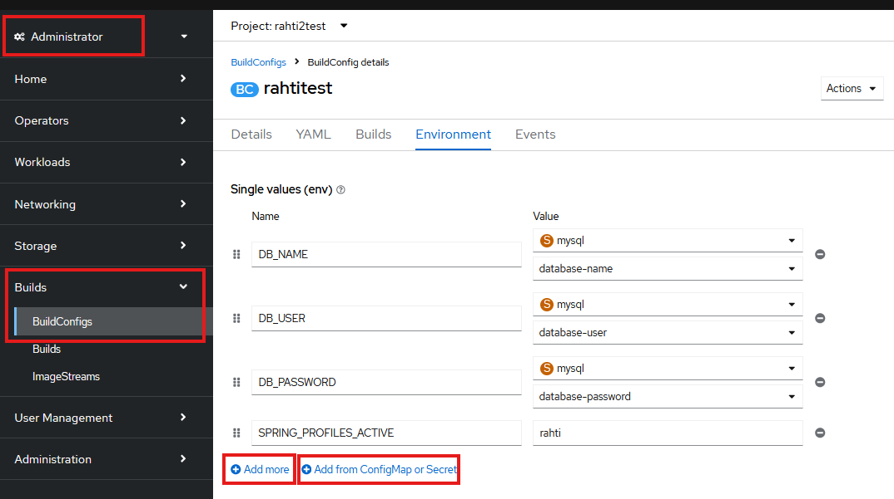

# Spring Boot -palvelimen konfigurointi käyttämään ulkoista tietokantapalvelua

Seuraavassa esimerkissä konfiguroidaan Spring Boot -palvelin käyttämään projektiin luotua tietokantapalvelua.

Esimerkissä palvelimessa käytettävän tietokannan asetukset hallitaan käyttämällä _Spring-profiileja_: julkaisun tietokantakonfiguraatiota varten määritellään oma profiili, joka määritellään otettavaksi käyttöön julkaisuympäristössä.

## Julkaisuprofiilin luonti Spring-projektiin

Profiili voidaan määritellä laatimalla projektiin profiilikohtainen `application.properties`-määritys. Sen nimeksi tulee asettaa `application-<profiilinimi>.properties`. Jos esimerkiksi profiilin nimeksi valitaan `rahti`, tiedoston nimi on `application-rahti.properties`.

Profiilikohtaiset asetukset luetaan globaalien asetusten lisäksi. Näin esim. julkaisukonfiguraatioparametrit voidaan määritellä jokaista julkaisuympäristöä varten eri tiedostoihin.

Seuraavassa esimerkissä käytetään palvelimen ajoympäristöstä luettavia ympäristömuuttuja-arvoja. Näin julkaisuympäristön konfiguraatioparametreja ei tarvitse viedä versionhallintaan.

Rahti-projektiin luotavat kontit saavat projektiin luodun tietokantapalvelun tiedot ajoympäristöön määritetyistä ympäristömuuttujista, joiden nimi muodostetaan tietokantapalvelun nimen perusteella seuraavasti:
``` { .yaml .no-copy }
  <tietokantapalvelun nimi>_SERVICE_HOST
  <tietokantapalvelun nimi>_SERVICE_PORT
```  

Voit avata kontin Terminal-näkymän ja tarkastella ympäristömuuttujia `env` komennolla. Alla olevassa kuvassa ympäristömuuttujista on listattu muuttujat, jotka kertovat tietokantapalvelun, jonka nimi on `mysql-service`, tiedot muille Rahti-projektin konteille.



Esimerkki profiilimääritystiedoston sisällöstä, jos tietokantapalvelun nimeksi on asetettu `db-service`:
```
spring.datasource.url=jdbc:mysql://${DB_SERVICE_SERVICE_HOST}:${DB_SERVICE_SERVICE_PORT}/${DB_NAME}
spring.datasource.username=${DB_USER}
spring.datasource.password=${DB_PASSWORD}
spring.jpa.show-sql=true
spring.jpa.generate-ddl=true
spring.jpa.hibernate.ddl-auto=update
```

Huom: Tietokantapalvelinta kytkettäessä muihin kontteihin, on tärkeää käyttää muuttujanimiä eikä esim. IP-osoitetta suoraan. IP-osoitteet voivat muuttua esimerkiksi kontin uudelleen käynnistymisen yhteydessä

## Ympäristömuuttujien asettaminen

Profiiliin määritellyt ympäristömuuttujat pitää vielä asettaa. Voit määritellä käynnistettävälle kontille ympäristömuuttujia Rahti-palvelun web-käyttöliittymässä kohdassa _Applications/Deployments_:



Ympäristömuuttujan arvon voidaan määritellä suoraan tai valita sen jostain projektiin luodusta salaisuudesta. 

Ylläolevassa esimerkissä MySQL-tietokannan tietokantakäyttäjän nimi `DB_USER` ja salasana `DB_PASSWORD` sekä tietokannan nimi `DB_NAME` luetaan salaisuudesta, joka luotiin tietokantapalvelun lisäämisen yhteydessä. 

Ympäristömuuttuja `SPRING_PROFILES_ACTIVE` määrittää, mikä profiili asetetaan aktiiviseksi. Sen arvoksi määritetään suoraan julkaisuprofiilin nimi.  

Kun julkaisu seuraavan kerran tehdään, käynnistyvässä kontissa ympäristömuuttujat on määritelty ja Spring ottaa oikean profiilin käyttöön.

