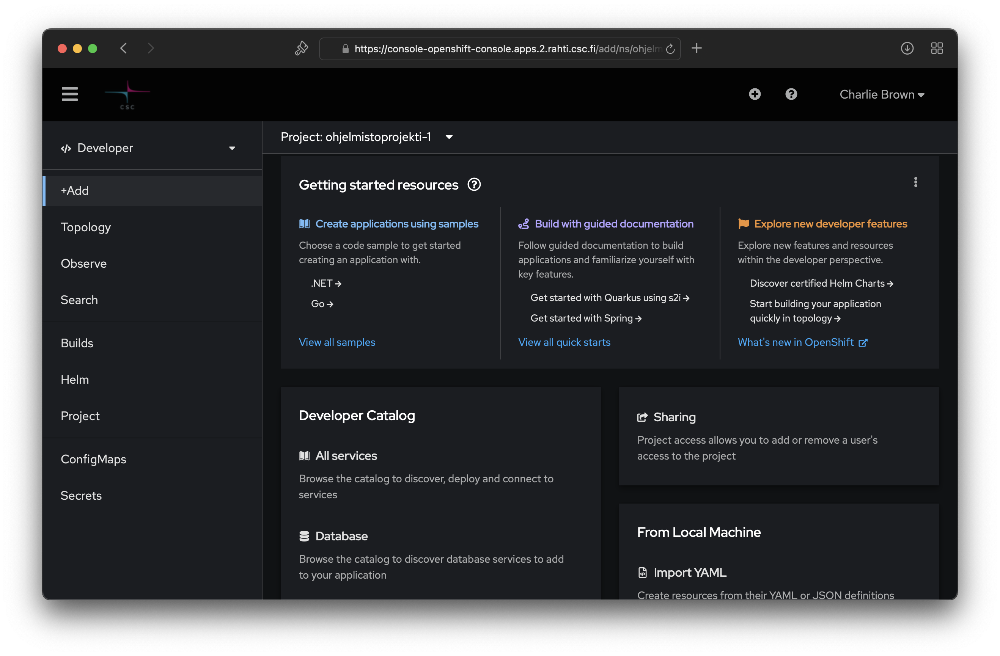
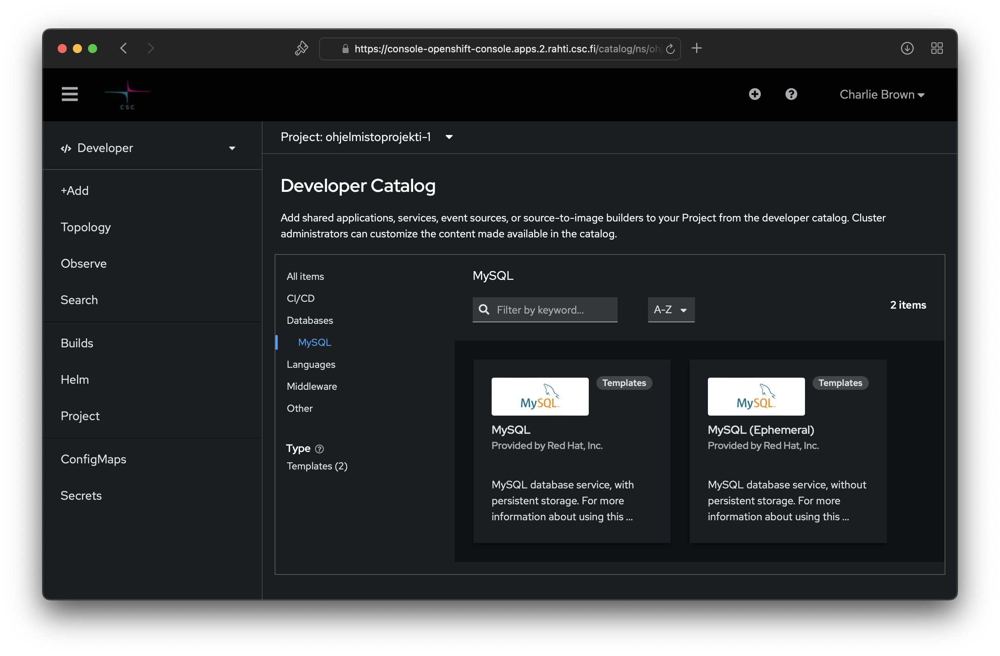
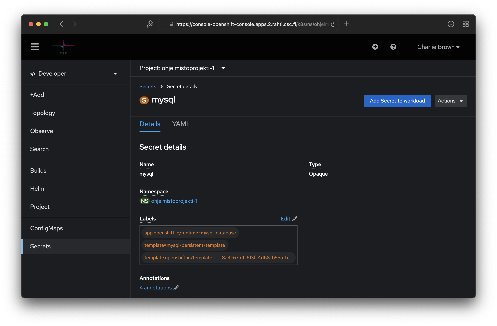

# Tietokantapalvelun luominen

Rahti-projektiin voi lisätä esivalmisteltuja kontteja _Developer/+Add_-näkymästä:





Tässä esimerkissä käytetään Database/MySQL-vaihtoehtoa. 

_Huom! Tarjolla olevat Ephemeral-versiot tietokantapalveluista käyttävät pelkästään väliaikaista tallennuskapasiteettia ja kaikki mahdolliset muutokset mm. tietokantaan häviävät samalla, kun kontin suoritus loppuu. Pysyvää tallennusta varten tulee valita "tavallinen" tietokantapalvelukontti ja sille dedikoitu Persistent Volume Claim (PVC) -tallennustila._

Avaa luontivelho painamalla 'Instantiate Template' nappia. Asetuksista kannattaa täydentää ainakin:

-	__Database Service Name__: Tietokantapalvelun nimi. Tällä nimellä muut kontit löytävät palvelun.
-	__MySQLConnection Username__: Käyttäjätunnus sql-palvelimelle kirjautumiseen.
-	__MySQL Connection Password__: Salasana sql-palvelimelle kirjautumiseen.
-	__MySQL Database Name__. Luotavan tietokannan nimi.

!!! note "Tietokantapalvelun nimi"
    Tässä annetusta tietokantapalvelun nimestä muodostetaan nimet ympäristömuuttujille, joilla projektin prosessit saavat tiedon tietokantapalvelusta, esim.
    ``` { .yaml .no-copy }
    <tietokantapalvelun nimi>_SERVICE_HOST
    <tietokantapalvelun nimi>_SERVICE_PORT
    ```  

    Muut tässä määritetyt tiedot välittyvät muihin podeihin salaisuuden kautta.


Luontivelho luo salaisuustiedoston (_secret_), johon tietokannan konfiguraatiotiedot talletetaan . 

Salaisuus luodaan, koska sitä käyttäen luottamuksellisia konfiguraatiotietoja ei tarvitse tallettaa versionhallintaan, eikä niitä tarvitse lainkaan käsitellä suoraan vaan ne voidaan lukea salaisuustiedostosta.


Salaisuudet (ja muut vastaavat resurssit) löytyvät Rahti-palvelun web-käyttöliittymästä _Administrator/Workloads_-valikon alta. Pelkät salaisuudet on nähtävillä myös valikosta _Developer/Secrets_.


