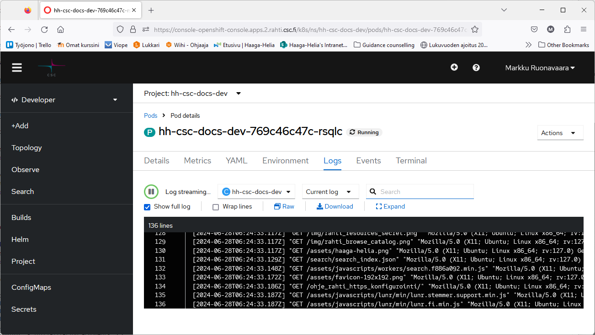

# Virheenjäljitys

## Podien tarkastelu

Käynnissä olevien konttien (_pod_) tietoja voidaan tarkastella Rahti-palvelun hallintaliittymässä.

Käynnissä olevat kontit ja niiden lokit löytyvät Developer-näkymästä.


Lokeja voi tarkastella välilehdellä _Logs_:



Konttiin saa pääteyhteyden välilehdellä _Terminal_:


Konttiin saa ssh-yhteyden myös komentorivillä komennolla `oc rsh <nimi>`. Projektin kontit voi listata komennolla `oc get pods`.

```bash
PS > oc get pods
NAME                  READY     STATUS      RESTARTS   AGE
dbservice-1-p2smq     1/1       Running     0          4h
ticketguru-11-sbqhn   1/1       Running     0          1h
PS > oc rsh ticketguru-11-sbqhn
~ $ 
```

## Tietokantapodin tarkastelu

Tietokantaa voi tarkastella tietokantajärjestelmän komentorivityökaluilla tietokantakontin pääteyhteydellä, esim. 
```bash
$ mysql -u dbuser -p dbname
```

## Projektin uudelleenluonti

Jos sovelluksen luonti `oc new-app`-komennolla jostain syystä ei onnistu, komennon uudelleenyrittäminen voi olla hankalaa, koska joitakin resursseja on jo luotu.
 
Helpointa saattaa olla poistaa koko Rahti-projekti ja luoda se alusta saakka uudelleen komentorivikomennnoin.

Seuraavissa esimerkeissä poistettavan ja uudelleen luotavan projektin nimi on `myproj`.

```
oc delete project myproj
oc new-project myproj --description='csc_project:2xxxxxx'
```

-  `xxxxxx` korvataan oman CSC-projektin tunnisteen kuudella viimeisellä numerolla
