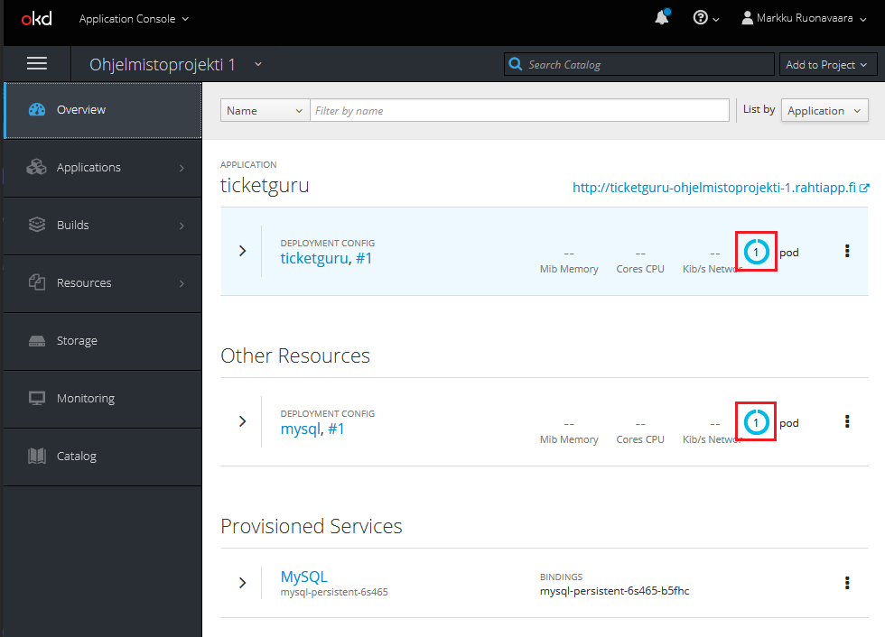
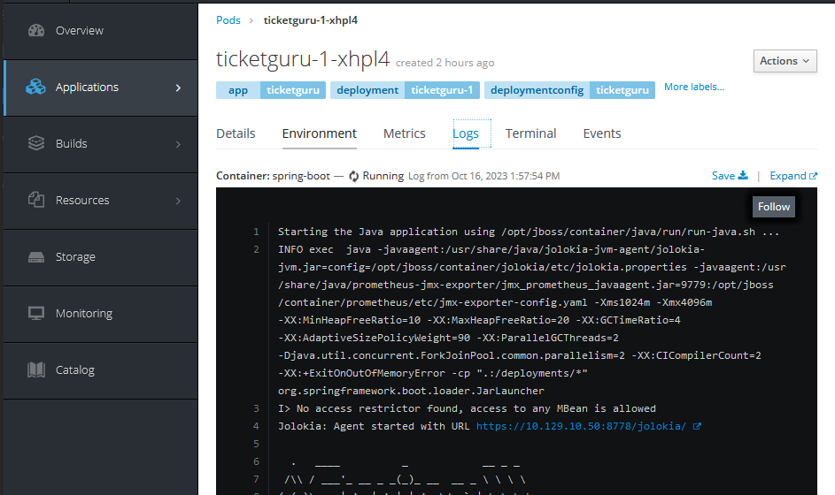
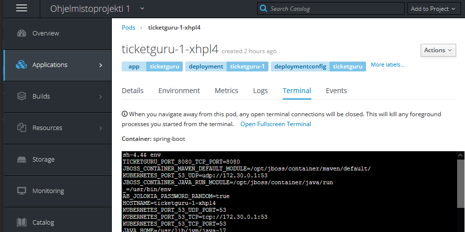

# Virheenjäljitys

## Podien tarkastelu

Käynnissä olevien konttien (_pod_) tietoja voidaan tarkastella Rahti-palvelun hallintaliittymässä.

Käynnissä olevat kontit ja niiden lokit löytyvät Developer-näkymästä.



Lokeja voi tarkastella välilehdellä _Logs_:



Konttiin saa pääteyhteyden välilehdellä _Terminal_:



Konttiin saa ssh-yhteyden myös komentorivillä komennolla `oc rsh <nimi>`. Projektin kontit voi listata komennolla `oc get pods`.

```bash
PS > oc get pods
NAME                  READY     STATUS      RESTARTS   AGE
dbservice-1-p2smq     1/1       Running     0          4h
ticketguru-11-sbqhn   1/1       Running     0          1h
PS > oc rsh ticketguru-11-sbqhn
~ $ 
```

## Projektin uudelleenluonti

Jos sovelluksen luonti jostain syystä menee pieleen, tilanteen selvittäminen voi joskus olla hankalaa, koska joitakin resursseja on jo luotu. 

Tällöin saattaa olla helpointa poistaa koko Rahti-projekti ja luoda se alusta saakka uudelleen. Sen voi tehdä joko Rahti-palvelun hallintaliittymästä _Home/Projects_ ja _Delete project_ tai komentorivillä `oc`-komennolla.

Komentorivikomennoin sen voi tehdä seuraavai (esimerkissä poistettavan ja uudelleen luotavan projektin nimi on `myproj`):

```
oc delete project myproj
oc new-project myproj --description='csc_project:2xxxxxx'
```

-  `xxxxxx` korvataan oman CSC-projektin tunnisteen kuudella viimeisellä numerolla
