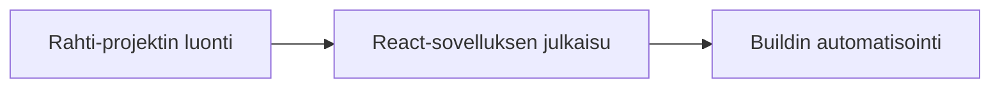

# React-sovelluksen julkaiseminen Rahti-ympäristössä

## Tavoite

Tässä ohjeessa käydään läpi React-sovelluksen julkaisu Rahti-palvelussa. 

Oletuksena on, että

- julkaisu tehdään GitHub-repositoriosta.

## Ennakkovaatimukset

Jos halutaan käyttää komentorivikomentoja, resepti edellyttää seuraavia toimenpiteitä:

- [Komentorivityökalun asennus](../rahti/komentorivityokalun_asennus.md)

## Resepti

1. [Luo Rahti-projekti](../rahti/projektin_luonti.md){target="_blank"}
2. [Julkaise React-sovellus](../rahti/react_julkaiseminen.md){target="_blank"}
3. [Automatisoi build (valinnainen)](../rahti/buildin_automatisointi.md){target="_blank"}

## Lisäohjeita

- [Virheenjäljitys](../rahti/virheenjaljitys.md){target="_blank"}
- [HTTPS-konfigurointi](../rahti/https_konfigurointi.md){target="_blank"}
- [Julkaisu yksityisestä repositoriosta](../rahti/julkaisu_yksityisesta_repositoriosta.md){target="_blank"}

