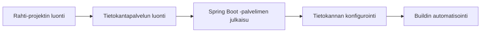

# Spring Boot -palvelun julkaiseminen Rahti-ympäristössä

## Tavoite

Tässä ohjeessa käydään läpi Spring-palvelun julkaisu Rahti-palvelussa. 

Oletuksena on, että 

- julkaistavassa palvelussa on Spring-palvelin ja relaatiotietokanta
- julkaisu tehdään GitHub-repositoriosta. 

Julkaisu tehdään esimerkissä vaiheittain.

## Ennakkovaatimukset

Resepti edellyttää seuraavia toimenpiteitä:

- [Komentorivityökalun asennus](../rahti/komentorivityokalun_asennus.md)

## Resepti

1. [Luo Rahti-projekti](../rahti/projektin_luonti.md)
2. [Luo projektiin tietokanta](../rahti/tietokantapalvelun_luominen.md)
3. [Julkaise Spring-palvelin ilman ulkoista tietokantaa](../rahti/spring_ilman_tietokantaa.md)
4. [Konfiguroi Spring-palvelin käyttämään ulkoista tietokantapalvelua](../rahti/spring_tietokannan_konfigurointi.md)
5. [Automatisoi build (valinnainen)](../rahti/buildin_automatisointi.md)

## Lisäohjeita

- [Virheenjäljitys](../rahti/virheenjaljitys.md)
- [HTTPS-konfigurointi](../rahti/https_konfigurointi.md)
- [Julkaisu yksityisestä repositoriosta](../rahti/julkaisu_yksityisesta_repositoriosta.md)

## Liittyviä ohjeita

- [Julkaisu paikallisesta hakemistosta JKube OpenShift Maven pluginilla](../rahti/spring_jkube_plugin.md)