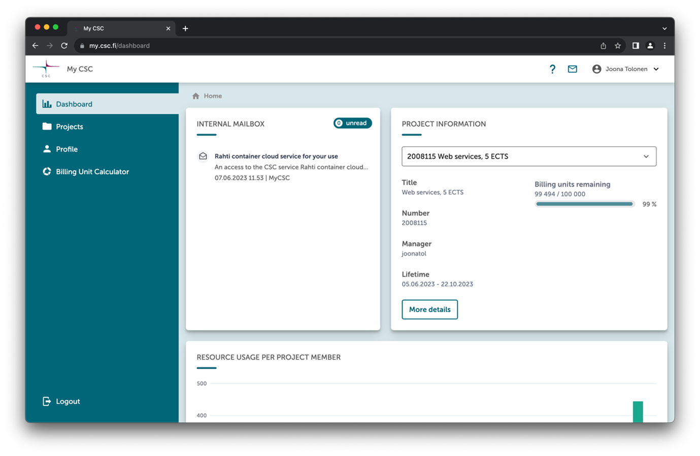
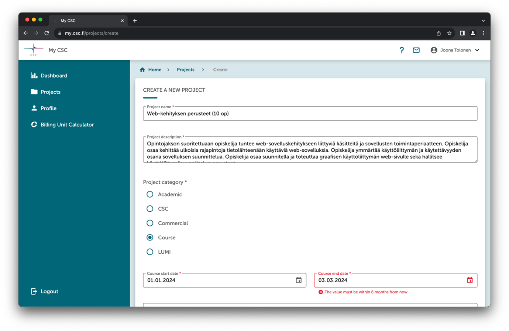
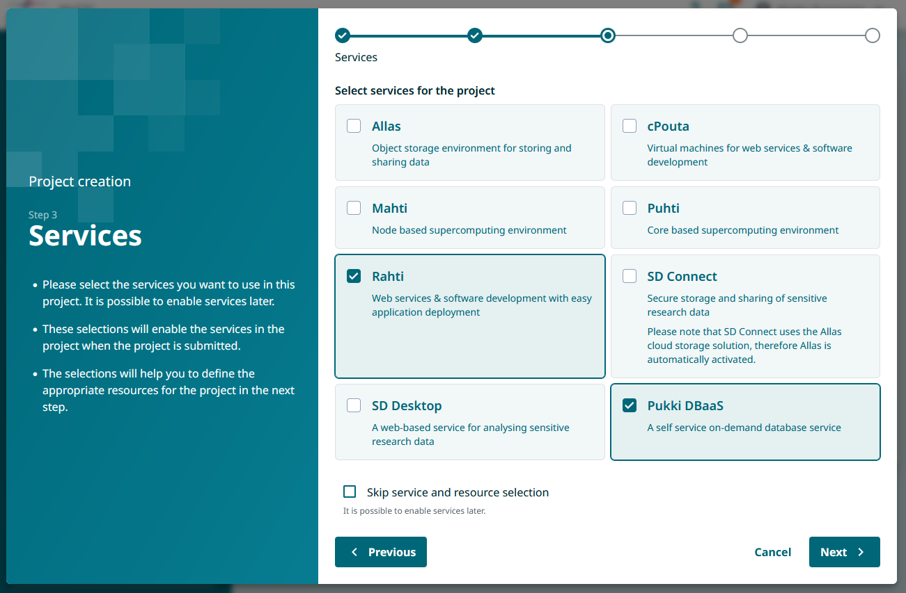
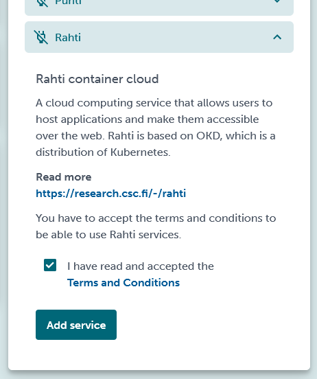
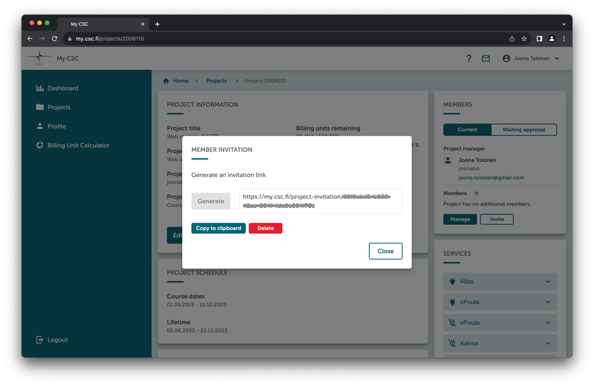

# CSC-palvelujen käyttö opetuksessa
Opettajan ohje

## Johdanto
MyCSC palvelussa perustetaan __projekteja__. Web-käyttöisen hallintanäkymän kautta MyCSC projektiin voidaan liittää käyttäjien lisäksi __palveluja__.

Palvelua, esimerkiksi Rahti-palvelua, konfiguroidessa puhutaan myös projektista.
MyCSC projekti sisältää palvelun, joka konfiguroidaan palvelun omassa projektissa. Muuta yhteistä näillä kahdella projektilla ei kuitenkaan ole.

Käsitteiden selkiyttämiseksi tässä ohjeessa näistä eri projekteista käytetään termejä __MyCSC-projekti__ ja __palveluprojekti__ (esim. Rahti-projekti): MyCSC-projekti on hallinnollinen projekti, johon voidaan liittää joukko palveluprojekteja.

## MyCSC-projektit kurssitoteutuksille

### Yleistä

Yhdelle kurssitoteutukselle perustetaan yksi MyCSC-projekti. 

Opettaja toimii projektin projektipäällikkönä ja hallinnoi projektiin liitettyjä palveluja sekä projektin käyttäjiä.

Projekteja hallinnoidaan MyCSC-palvelun kautta. Palvelu löytyy osoitteesta https://my.csc.fi. Palvelun käyttäminen vaatii oman CSC-tunnuksen, joka on otettavissa käyttöön korkeakoulujen Haka-kirjautumispalvelun avulla. 

CSC-tunnuksen luominen tapahtuu ensimmäisen kirjautumisen yhteydessä, ja jatkossa palveluun voi kirjautua suoraan Haka-tunnuksella tai luodulla CSC-tunnuksella.

Tunnusten luonnin ja kirjautumisen jälkeen avautuu MyCSC:n hallintanäkymä.

### Uuden MyCSC-projektin perustaminen

Uuden projektin pääsee luomaan näkymän vasemman reunan valikosta _Projects_ ja sen takaa löytyvän sivun oikeasta yläkulmasta painamalla nappia _New project_.
Painike avaa uuden projektin luontinäkymän.

Kurssiprojektista on hyvä huomioida seuraavat seikat:
- Opetuskäytössä projektikategoriaksi tulee valita _Course_.
-	Kurssin päättymispäivä voi olla korkeintaan kuuden kuukauden päässä luontipäivästä.
-	Kurssiprojekti on kertakäyttöinen. Sitä ei voi jatkaa, kopioida eikä siihen voi pyytää lisäresursseja. Oletusresurssi projektille on 100 000 BU:ta.
- Projekti ja kaikki sen resurssit poistetaan automaattisesti loppumisajan jälkeen.
-	Kurssiprojekteja voi olla käynnissä yhtä aikaa useita.
-	Kurssiprojektien palveluihin ei saa tallentaa henkilökohtaisia tietoja.

BU eli Billing Unit on laskennallinen yksikkö, jolla seurataan resurssien käyttöä projektissa. Käyttö, yksikön nimestä huolimatta, on korkeakoulujen henkilökunnalle ja opiskelijoille opetuskäytössä ilmaista.
Lisätietoa BU:sta löytyy osoitteesta https://docs.csc.fi/accounts/billing/ ja Rahti-palvelun resurssien käytöstä yksityiskohtaisempaa tietoa löytyy osoitteesta https://docs.csc.fi/cloud/rahti/billing/.

### Palvelujen valinta

Projektin kautta projektin jäsenet pääsevät käsiksi CSC:n palveluihin. Oletuksena mitään palvelua ei ole liitetty projektiin, vaan projektipäällikkö valitsee haluamansa palvelut MyCSC sivuston kautta 

Projektin palvelut valitaan palvelulistasta yksi kerrallaan.

Käyttääkseen palveluja, jokaisen projektijäsenen tulee hyväksyä palvelujen käyttöehdot. Projektiin lisätyistä palveluista lähetetään kaikille projektin jäsenille sähköposti, jossa pyydetään hyväksymään palvelun ehdot MyCSC sivustolla.

 

Kun halutut palvelut on valittu projektille ja käyttäjät ovat hyväksyneet palvelun käyttöönoton, voidaan niiden käyttö aloittaa.

#### Palvelujen konfigurointi

Kun projektille on valittu halutut palvelut, niiden käyttöönotto ja konfigurointi tapahtuu kunkin palvelun omalta sivustolta. 

Tärkeimmät palvelut ja niiden osoitteet on listattu taulukkoon

| Palvelu	| Osoite |	Kuvaus |
| ------- |------- | ------- |
| MyCSC	| https://my.csc.fi | Projektien hallintapalvelu |
| Allas	| https://pouta.csc.fi | Tallennuspalvelu |
| cPouta | https://pouta.csc.fi | Virtualisointipalvelu |
| Notebooks	| https://notebooks.csc.fi | Jupyter Notebooks |
| Puhti ja Mahti | https://puhti.csc.fi https://mahti.csc.fi | Laskentapalvelu |
| Rahti	| https://rahti.csc.fi | Konttipalvelu |
| Pukki	| https://pukki.dbaas.csc.fi | DBaaS (beta) |

### Opiskelijoiden lisääminen projektiin

Jos opiskelijat tarvitsevat suoran pääsyn palveluihin (esim. Rahti), heidän tulee liittyä MyCSC-projektin jäseneksi.

Projektipäällikkö (opettaja) lisää opiskelijat osaksi projektia, joko etsimällä heidät projektihallinnan _Members- näkymässä CSC-tunnuksella tai lähettämällä opiskelijoille kutsulinkin.

Kutsulinkin voi generoida painamalla _Invite_ painiketta ja lähettämällä linkin opiskelijoille esimerkiksi sähköpostilla tai lisäämällä sen Moodle-kurssin työtilaan. Linkillä kutsutut opiskelijat hyväksytään projektijäseneksi _Members_ näkymän _Waiting approval_ valinnasta.

Kun opettaja on hyväksynyt opiskelijat projektin jäseneksi, tulee opiskelijoiden vielä hyväksyä MyCSC sivuston kautta projektiin valittujen palvelujen käyttöehdot.

Jos opiskelijat käyttävät pelkästään CSC ympäristöön pystytettyjä palveluja (esim. www-sivustot, sql-palvelin, tms.), joissa on toteutettu oma käyttäjänhallinta, opiskelijan liittäminen CSC-projektiin ei ole välttämätöntä. Esimerkkinä tämmöisestä voisi olla opettajan pystyttämä Wordpress-sivusto ja johon opiskelijat kirjautuvat Wordpressiin tehdyillä käyttäjätunnuksilla.

