<style>
  body {
counter-reset : h2;
    }

h2 {
counter-reset : h3;
    }

h3 {
counter-reset : h4;
    }

h4 {
counter-reset : h5;
    }

h5 {
counter-reset : h6;
    }

h2:before {
content : counter(h2,decimal) ". ";
counter-increment : h2;
    }

h3:before {
content : counter(h2,decimal) "." counter(h3,decimal) ". ";
counter-increment : h3;
    }

h4:before {
content : counter(h2,decimal) "." counter(h3,decimal) "." counter(h4,decimal) ". ";
counter-increment : h4;
    }

h5:before {
content : counter(h2,decimal) "." counter(h3,decimal) "." counter(h4,decimal) "." counter(h5,decimal) ". ";
counter-increment : h5;
    }

h6:before {
content : counter(h2,decimal) "." counter(h3,decimal) "." counter(h4,decimal) "." counter(h5,decimal) "." counter(h6,decimal) ". ";
counter-increment : h6;
    }

h2.nocount:before, h3.nocount:before, h4.nocount:before, h5.nocount:before, h6.nocount:before {
content : "";
counter-increment : none;
    }
</style>

# Spring Boot -palvelun julkaiseminen Rahti-ympäristössä

Tässä ohjeessa käydään läpi Spring-palvelun julkaisu Rahti-palvelussa. 

Oletuksena on, että julkaistavassa palvelussa on Spring-palvelin sekä relaatiotietokanta. Julkaisu tehdään seuraavassa esimerkissä vaiheittain:

1. Rahti-palvelun luonti
2. Spring palvelimen julkaisu ilman ulkoista tietokantaa
3. Tietokantapalvelun luonti
4. Spring-palvelimen konfigurointi käyttämään ulkoista tietokantapalvelua

## Rahti-palvelun luonti

Jotta Rahti-palvelua voi käyttää, pitää sen olla otettuna käyttöön MyCSC projektissa ja itse Rahti-palveluun pitää olla määriteltynä Rahti-projekti. 

Kirjaudu rahtipalveluun osoitteessa https://rahti.csc.fi:8443 käyttämällä Haka-kirjautumista. Kirjautumisen jälkeen palvelun etusivu näyttää tältä:

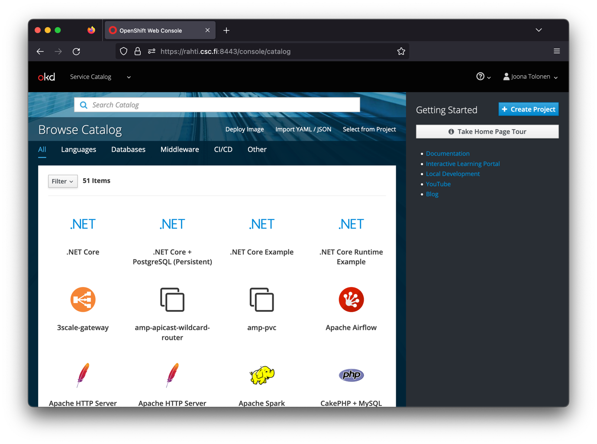

Lisää itsellesi Rahti-projekti painamalla ’Create Project’ painiketta näkymän oikeasta yläreunasta. Anna projektille kuvaava nimi.

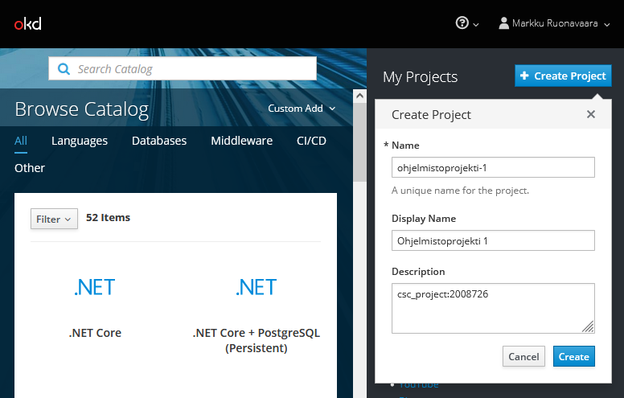

MyCSC:n projektinäkymässä näkyvä projektinumero tulee mainita Rahti-projektin kuvauskentässä projektia luotaessa. Tällä mekanismilla palvelun käytöstä syntyneet kulut kohdennetaan määriteltyyn MyCSC projektiin.

Kirjaa projektinumero projektin kommenttikenttään seuraavasti:
```
csc_project:\<projektinumero>
```
Korvaa _\<projektinumero>_ oman MyCSC projektisi numerosarjalla.

Kun painat _Create_, luodaan Rahti-projekti, johon voidaan määritellä tarvittavia palveluja ja resursseja.

Rahti-projektit ovat henkilökohtaisia, eikä oletuksena näy muille. Projektiin kuitenkin mahdollista lisätä muita käyttäjiä heidän CSC tunnuksellaan _Resources/Membership_-asetuksen kautta.

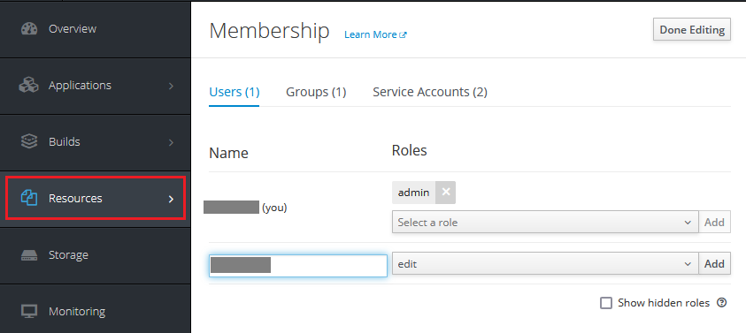

Opiskelija voi halutessaan lisätä esimerkiksi kurssin opettajan omaan projektiinsa.

## Spring Boot -palvelimen julkaisu

Seuraavassa käydään läpi Spring Boot -palvelimen julkaisu ilman ulkoista tietokantaa. Tietokannan konfigurointi käsitellään seuraavassa luvussa.
   
### Komentorivityökalun asennus

Red Hat tarjoaa työkalun nimeltään `oc` OpenShift ympäristön hallintaan komentoriviltä käsin (Red Hat, 2023a) 

JKuben OpenShift Maven lisäosa hyödyntää `oc`-komentoa Spring sovelluksen automaattisessa lataamisessa OpenShift ympäristöön suoritettavaksi. Oc-työkalun lataamiseen löytyy linkki Rahti-palvelun hallintanäkymästä.

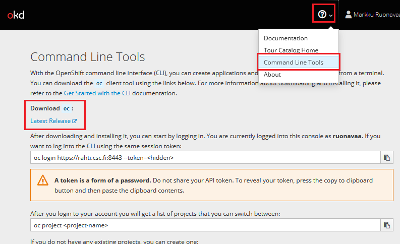

Linkistä avautuvalta sivustolta voi ladata omalle käyttöjärjestelmälle soveltuvan version. Linkeistä latautuu yksittäinen, suoritettava tiedosto nimeltään `oc`. Kyseisen tiedoston tulee löytyä käyttöjärjestelmän polusta (esim. Windows-ympäristön `PATH`-muuttujan määrittämässä sijainnissa) tai sen Spring-sovelluksen hakemistosta, mistä komentoja suoritetaan.

Jatkossa oletetaan, että `oc`-työkalu on talletettu siihen hakemistoon, jossa komento annetaan.

### Spring-palvelun julkaisu


####	JKube OpenShift Maven pluginin käyttöönotto

Eclipse JKube on kokoelma lisäosia ja kirjastoja, joiden avulla helpotetaan Java-ohjelmistojen kontittamista ja julkaisua OpenShift konttipalveluun. 

Lisäosan käyttöönotto on suoraviivaista: Lisää Spring Boot projektin pom.xml tiedostoon JKube-lisäosan määritys:

```xml
<build>
	<plugins>

		<plugin>
			<groupId>org.eclipse.jkube</groupId>
			<artifactId>openshift-maven-plugin</artifactId>
		</plugin>

	</plugins>
</build>
```
#### Julkaisu

Kirjaudu rahti-palveluun komentorivin kautta. Tämä tapahtuu valitsemalla web käyttöliittymänäkymän oikeasta yläkulmasta oma nimi ja sen alta avautuvasta valikosta ’Copy Login Command’.

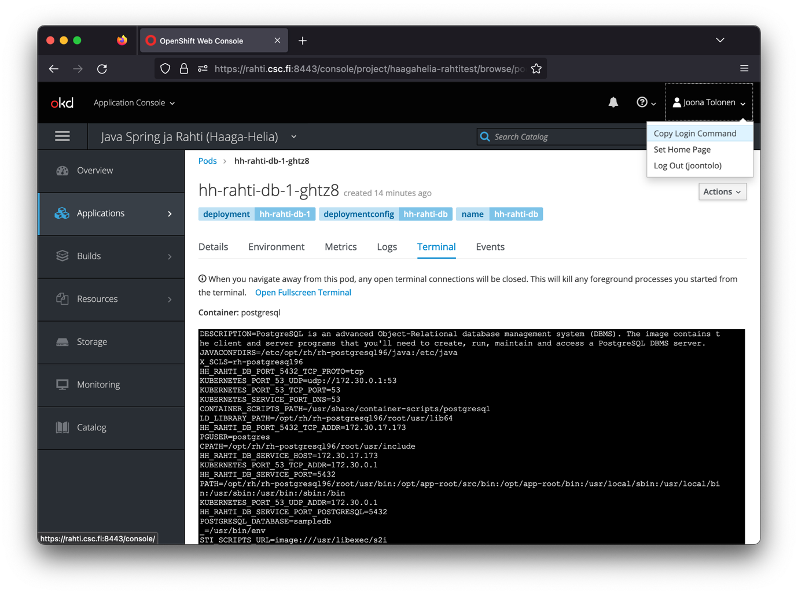

Liitä komento leikepöydältä paikallisen koneesi komentoriville ja suorita se projektin juurihakemistossa.  

Huom! Jos `oc`-komento ei ole polussa, voi olla tarpeen antaa komennonlle myös polku, esim.
```bash
./oc login https://rahti.csc.fi:8443 -token=...
```
Tämän jälkeen julkaisu voidaan tehdä maven -komennolla:
``` bash
./mvnw package oc:build oc:resource oc:apply
```
Komento valmistelee Java projektin, luo ja alustaa OpenShift ympäristöön soveltuvan kontin ja lataa kontin suoritukseen OpenShift ympäristöön.

Komennon päättymisen jälkeen Rahti-projektin Overview-näkymästä voit saada tietoa julkaisun tilasta ja onnistumisesta, sekä löydät julkaistun palvelun URL-osoitteen.

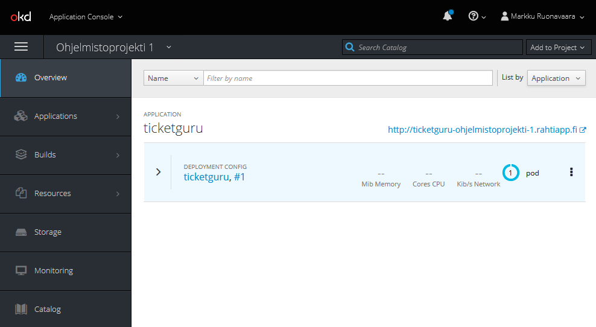


## Tietokantapalvelun luominen

Esivalmisteltuja kontteja voi lisätä Browse Catalog näkymästä:

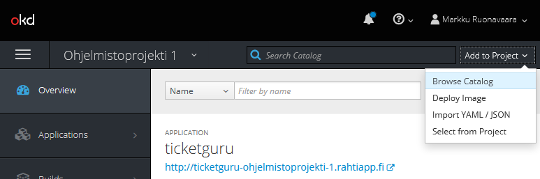

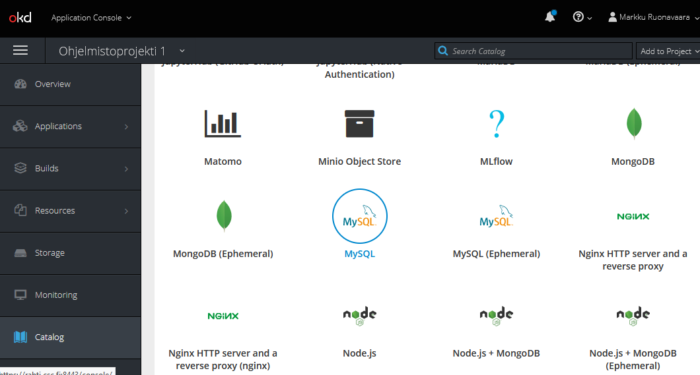

Tässä esimerkissä käytetään MySQL-vaihtoehtoa. 

_Huom! Tarjolla olevat Ephemeral-versiot tietokantapalveluista käyttävät pelkästään väliaikaista tallennuskapasiteettia ja kaikki mahdolliset muutokset mm. tietokantaan häviävät samalla, kun kontin suoritus loppuu. Pysyvää tallennusta varten tulee valita "tavallinen" tietokantapalvelukontti ja sille dedikoitu Persistent Volume Claim (PVC) -tallennustila._

Etene luontivelhon näkymässä ’Next’ painikkeella konfigurointikohtaan ja täytä kontille haluamasi asetukset. Asetuksista kannattaa täydentää ainakin:
-	__Database Service Name__: Tietokantapalvelun nimi. Tällä nimellä muut kontit löytävät palvelun.
-	__MySQLConnection Username__: Käyttäjätunnus sql-palvelimelle kirjautumiseen.
-	__MySQL Connection Password__: Salasana sql-palvelimelle kirjautumiseen.
-	__MySQL Database Name__. Luotavan tietokannan nimi.

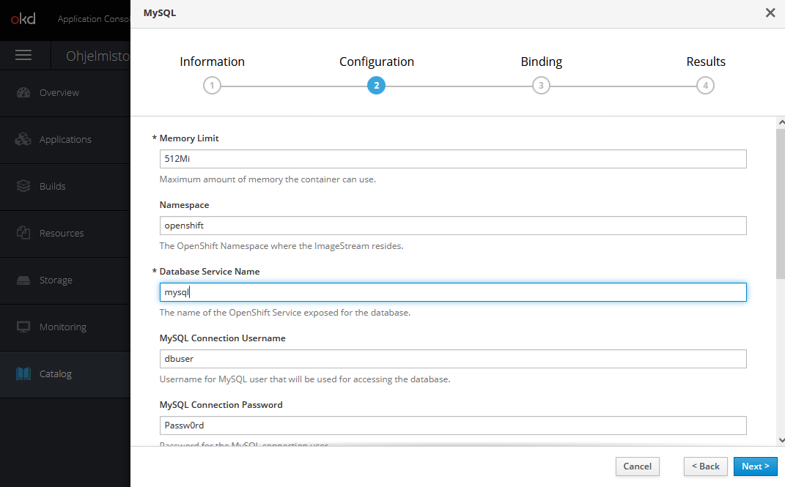

Luontivelho tarjoaa mahdollisuuden luoda tietokannan luonnin yhteydessä salaisuustiedosto (_secret_), johon talletetaan tietokannan konfiguraatiotiedot. 

Salaisuus kannattaa luoda, sillä sitä käyttäen luottamuksellisia konfiguraatiotietoja ei tarvitse tallettaa versionhallintaan, eikä niitä tarvitse lainkaan käsitellä suoraan vaan ne voidaan tarvittaessa lukea salaisuustiedostosta.

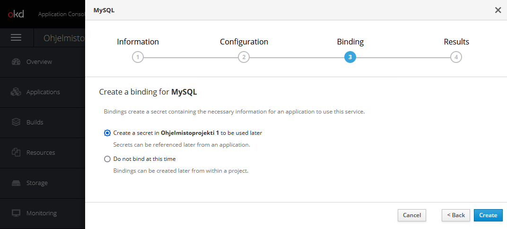

Salaisuudet (ja muut vastaavat resurssit) löytyvät Rahti-palvelun web-käyttöliittymästä _Resources_-valikon alta.

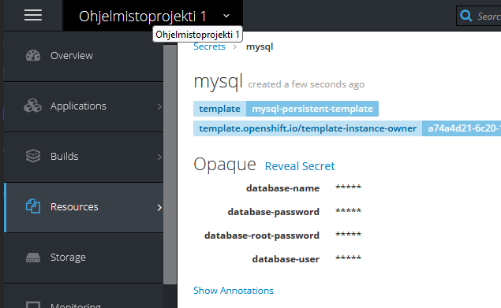

## Spring Boot -palvelimen konfigurointi käyttämään ulkoista tietokantapalvelua

Seuraavassa esimerkissä konfiguroidaan Spring Boot -palvelin käyttämään projektiin luotua tietokantapalvelua.

Esimerkissä palvelimessa käytettävän tietokannan asetukset hallitaan käyttämällä Spring-profiileja: tietokantakonfiguraatiota varten määritellään oma profiili, joka määritellään käyttöön julkaisuympäriristössä.

### Julkaisuprofiilin luonti Spring-projektiin

Profiili voidaan määritellä laatimalla projektiin profiilikohtainen `application.properties`-määritys. Sen nimeksi tulee asettaa `application-<profiilinimi>.properties`. Jos esimerkiksi profiilin nimeksi valitaan `rahti`, tiedoston nimi on `application-rahti.properties`.

Profiilikohtaiset asetukset luetaan globaalien asetusten lisäksi. Näin esim. julkaisukonfiguraatioparametrit voidaan määritellä jokaista julkaisuympäristöä varten eri tiedostoihin.

Seuraavassa esimerkissä käytetään palvelimen ajoympäristöstä luettavia ympäristömuuttuja-arvoja. Näin julkaisuympäristön konfiguraatioparametreja ei tarvitse viedä versionhallintaan.

Rahti-projektiin luotavat kontit saavat projektiin luodun tietokantapalvelun tiedot ajoympärisöön määritetyistä ympäristömuuttujista, joiden nimi muodostetaan tietokantapalvelun nimen perusteella seuraavasti:
```
  <tietokantapalvelun nimi>_SERVICE_HOST
  <tietokantapalvelun nimi>_SERVICE_PORT
```  

Voit avata kontin Terminal-näkymän ja tarkastella ympäristömuuttujia `env` komennolla. Alla olevassa kuvassa ympäristömuuttujista on lsitattu muuttujat, jotka kertoo tietokantapalvelun, jonka nimi on `mysql-service`, tiedot muille Rahti-projektin konteille.

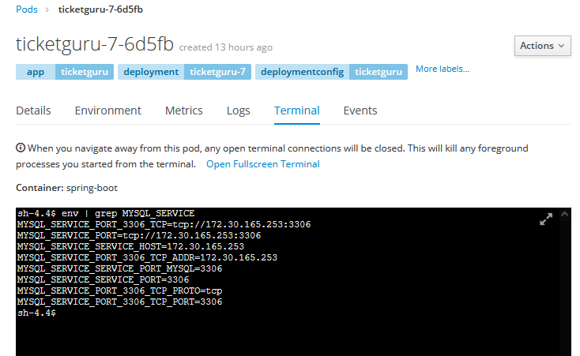

Esimerkki profiilimääritystiedoston sisällöstä, jos tietokantapalvelun nimeksi on asetettu `db-service`:
```
spring.datasource.url=jdbc:mysql://${DB_SERVICE_SERVICE_HOST}:${DB_SERVICE_SERVICE_PORT}/${MYSQL_DATABASE}
spring.datasource.username=${MYSQL_USER}
spring.datasource.password=${MYSQL_PASSWORD}
spring.jpa.show-sql=true
spring.jpa.generate-ddl=true
spring.jpa.hibernate.ddl-auto=update
```

Huom: Tietokantapalvelinta kytkettäessä muihin kontteihin, on tärkeää käyttää muuttujanimiä eikä esim. IP-osoitetta suoraan. IP-osoitteet voivat muuttua esimerkiksi kontin uudelleen käynnistymisen yhteydessä

### Ympäristömuuttujien asettaminen ajoympäristössä

Koska käyttämämme OpenShift Maven plugin yliajaa kaikki web-käyttöliittymässä tehdyt konttiasetukset, on määritykset tehtävä pluginin määritystiedostossa.

Tarkista Rahti-palvelun hallintakäyttöliittymästä tietokannan luonnin yhteydessä luodun salaisuuden nimi. Tässä esimerkissä se on `mysql-secret`. 

Lisää Spring sovelluksen hakemistorakenteeseen `src/main/jkube` tiedosto nimeltään `deployment.yml`.
```
spec:
  template:
    spec:
      containers:
        - env:
            - name: MYSQL_USER
              valueFrom:
                secretKeyRef:
                  key: database-user
                  name: mysql-secret
            - name: MYSQL_PASSWORD
              valueFrom:
                secretKeyRef:
                  key: database-password
                  name: mysql-secret
            - name: MYSQL_DATABASE
              valueFrom:
                secretKeyRef:
                  key: database-name
                  name: mysql-secret
            - name: SPRING_PROFILES_ACTIVE
              value: rahti
```

Parametrien selitykset:
- `name` on asetettavan ympäristömuuttujan nimi
- `valueFrom.secretKeyRef.name` määrittää, minkä nimisestä salaisuudesta arvo luetaan. Vaihda tähän omasta ympäristöstäsi oikea salaisuuden nimi.
- `valueFrom.secretKeyRef.key` määrittää, mistä salaisuuden kentästä arvo luetaan.
- Lopuksi asetaan ympäristömuuttujan SPRING_PROFILES_ACTIVE arvoksi halutun profiilin nimi. Käytettävä Spring-profiili voidaan asettaa ympäristömuuttujalla SPRING_PROFILES_ACTIVE.

Huomaa, että tiedostomuoto on YAML. Sen rakenteeseen on tarvittaessa hyvä hakea vinkkiä web-käyttöliittymästä valitsemalla tietokantapodin valikosta _Edit YAML_.

### Julkaisu

Suorita komento 
```
 ./mvnw package oc:build oc:resource oc:apply
```
Rahti-projektin _Overview_-näkymässä voi seurata julkaisun etenemistä. Onnistuneen julkaisun jälkeen näkymässä näkyy, että sekä sovelluspalvelinkontti(Spring Boot-palvelin) että tietokantapalvelinkontti ovat käynnissä.

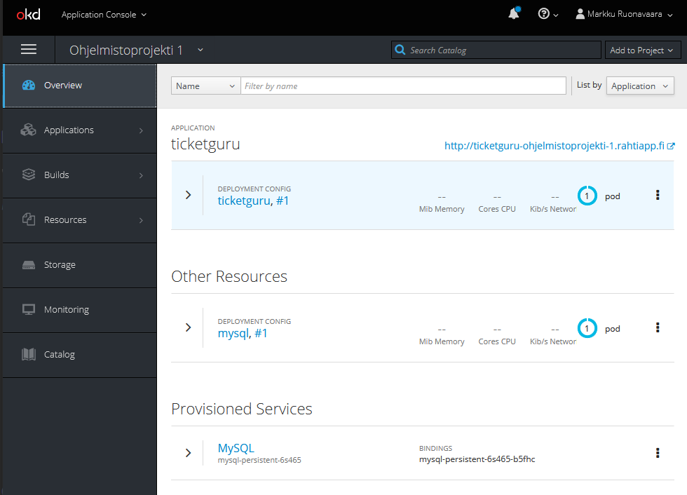


## HTTPS-konfigurointi

Julkaistu palvelu tarjotaan oletusarvoisesti vain HTTP-protokollalla. Palvelu voidaan konfiguroida tarjottavaksi myös HTTPS-protokollalla tai pelkästään HTTPS-protokollalla.

Määritys tehdään Rahti-sovelluksen Route-määrittelyssä.

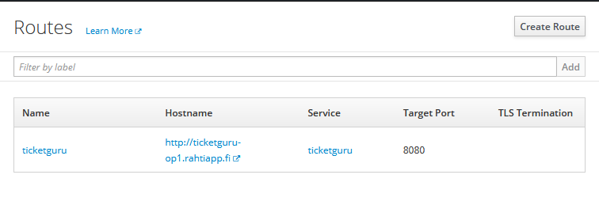

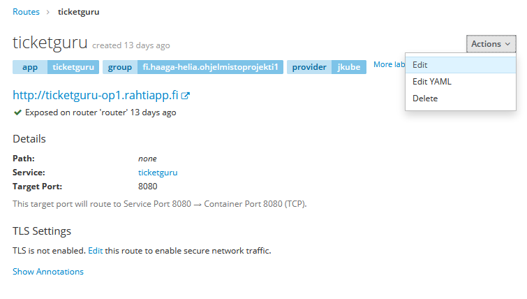

Reitille voidaan konfiguroida TLS käyttöön. Jos sertifikaatin jättää määrittämättä, käytetään oletussertifikaattia. HTTP-liikenteen voi joko sallia, estää tai uudelleenohjata.

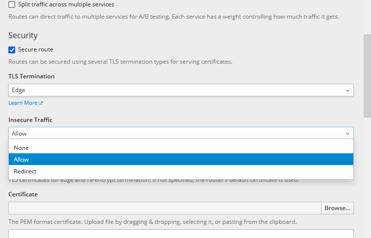

## Virheenjäljitys

Käynnissä olevien konttien (_pod_) tietoja voidaan tarkastella Rahti-palvelun hallintaliittymässä.

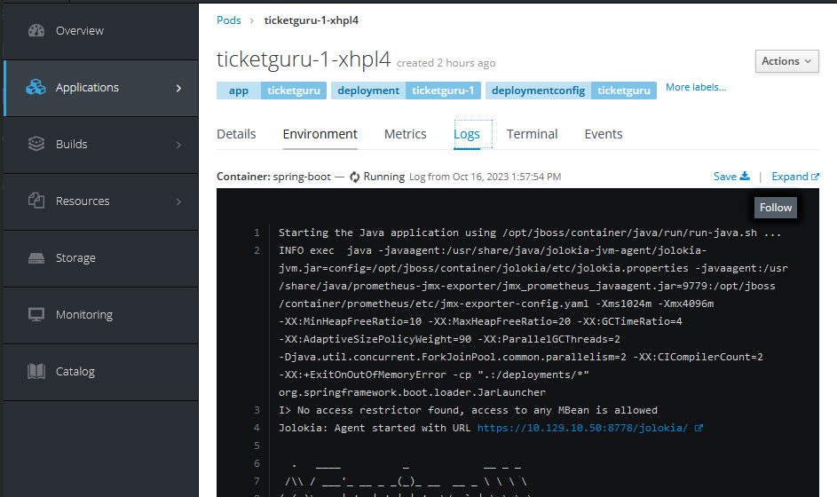
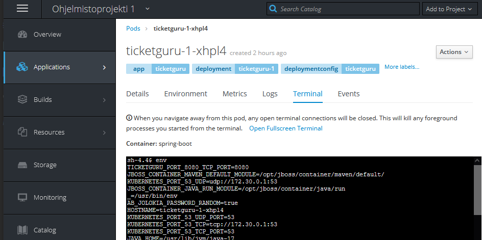

Käynnissä olevat kontit löytyvät helposti Overview-näkymästä.

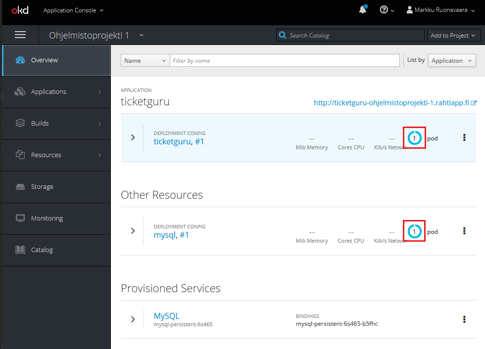

Tietokantaa voi tarkastella tietokantajärjestelmän komentorivityökaluilla tietokantakontin pääteyhteydellä, esim. 
```bash
$ mysql -u dbuser -p dbname
```


